# Recall Architecture Design Document

## Overview

Recall is a privacy-first Chrome extension that enables users to capture web content (including web pages, PDFs, images, and other browser-viewable content) with voice or text annotations, process them locally using Chrome's built-in Gemini Nano AI, and retrieve them through semantic search. The architecture prioritizes on-device processing, efficient storage, and seamless user experience while maintaining extensibility for future hybrid AI capabilities.

### Design Principles

1. **Privacy First**: All core processing occurs on-device using Gemini Nano. No data leaves the user's computer by default.
2. **Universal Capture**: Support any content viewable in a browser tab (HTML, PDF, SVG, PNG, etc.)
3. **Non-Blocking UX**: Capture and processing happen asynchronously without interrupting browsing
4. **Efficient Storage**: Optimize for quick retrieval with thumbnails, indexes, and source grouping
5. **Extensible Architecture**: Design for future hybrid mode (on-device + cloud) with minimal refactoring
6. **Multimodal AI**: Leverage audio, text, and image inputs to demonstrate Chrome AI capabilities

### Technology Stack

- **Extension Framework**: Chrome Extension Manifest V3
- **UI Layer**: HTML5, CSS3, Vanilla JavaScript (or lightweight framework like Lit)
- **Storage**: IndexedDB for structured data and Blobs
- **AI Processing**: Chrome Built-in AI APIs (Prompt, Summarizer, Rewriter, Proofreader, Writer)
- **Communication**: Chrome Runtime Messaging API, Message Ports
- **Media Capture**: Web Audio API, Canvas API for screenshots

## Architecture

### High-Level Architecture

The extension follows a layered architecture with clear separation of concerns:


```
┌─────────────────────────────────────────────────────────────────┐
│                        LAYER 1: USER INTERFACE                  │
│  ┌──────────────────────┐         ┌─────────────────────────┐  │
│  │   Content Script     │         │     Side Panel UI       │  │
│  │  (capture-ui.js)     │         │  (sidepanel.html/js)    │  │
│  │  - Selection overlay │         │  - Scrap list view      │  │
│  │  - Mic/text buttons  │         │  - Search interface     │  │
│  │  - Screenshot capture│         │  - Magic buttons        │  │
│  └──────────────────────┘         └─────────────────────────┘  │
└─────────────────────────────────────────────────────────────────┘
                              ↓ ↑                    ↓ ↑
                    chrome.runtime.sendMessage   Message Ports
                              ↓ ↑                    ↓ ↑
┌─────────────────────────────────────────────────────────────────┐
│                    LAYER 2: BUSINESS LOGIC                      │
│                  ┌──────────────────────────┐                   │
│                  │    Service Worker        │                   │
│                  │   (background.js)        │                   │
│                  │  - Message orchestration │                   │
│                  │  - Workflow coordination │                   │
│                  │  - State management      │                   │
│                  └──────────────────────────┘                   │
└─────────────────────────────────────────────────────────────────┘
                              ↓ ↑
                        Function Calls
                              ↓ ↑
┌─────────────────────────────────────────────────────────────────┐
│                      LAYER 3: SERVICES                          │
│  ┌──────────────────────┐         ┌─────────────────────────┐  │
│  │    AI Handler        │         │   Storage Handler       │  │
│  │  (ai-handler.js)     │         │   (storage.js)          │  │
│  │  - API abstraction   │         │  - IndexedDB wrapper    │  │
│  │  - Parallel execution│         │  - Source grouping      │  │
│  │  - Error handling    │         │  - Query optimization   │  │
│  └──────────────────────┘         └─────────────────────────┘  │
└─────────────────────────────────────────────────────────────────┘
                ↓ ↑                              ↓ ↑
           Async Calls                      Async Calls
                ↓ ↑                              ↓ ↑
┌─────────────────────────────────────────────────────────────────┐
│                    LAYER 4: EXTERNAL SYSTEMS                    │
│  ┌──────────────────────┐         ┌─────────────────────────┐  │
│  │   Gemini Nano APIs   │         │      IndexedDB          │  │
│  │  - Prompt API        │         │  - scraps store         │  │
│  │  - Summarizer API    │         │  - sourceGroups store   │  │
│  │  - Rewriter API      │         │  - Indexes              │  │
│  │  - Proofreader API   │         └─────────────────────────┘  │
│  │  - Writer API        │                                       │
│  └──────────────────────┘         ┌─────────────────────────┐  │
│                                    │    Chrome APIs          │  │
│                                    │  - runtime, tabs        │  │
│                                    │  - sidePanel, storage   │  │
│                                    └─────────────────────────┘  │
└─────────────────────────────────────────────────────────────────┘
```


## Diagram 1: Component Architecture

This diagram shows the detailed component structure with communication patterns:

```mermaid
graph TB
    subgraph UI["LAYER 1: USER INTERFACE"]
        CS[Content Script<br/>capture-ui.js<br/>• Selection overlay<br/>• Mic/text buttons<br/>• Screenshot capture]
        SP[Side Panel<br/>sidepanel.html/js<br/>• Scrap list view<br/>• Search interface<br/>• Magic buttons]
    end
    
    subgraph BL["LAYER 2: BUSINESS LOGIC"]
        SW[Service Worker<br/>background.js<br/>• Message orchestration<br/>• Workflow coordination<br/>• State management]
    end
    
    subgraph SVC["LAYER 3: SERVICES"]
        AIH[AI Handler<br/>ai-handler.js<br/>• API abstraction<br/>• Parallel execution<br/>• Error handling]
        STH[Storage Handler<br/>storage.js<br/>• IndexedDB wrapper<br/>• Source grouping<br/>• Query optimization]
    end
    
    subgraph EXT["LAYER 4: EXTERNAL SYSTEMS"]
        NANO[Gemini Nano APIs<br/>• Prompt API<br/>• Summarizer API<br/>• Rewriter API<br/>• Proofreader API<br/>• Writer API]
        IDB[(IndexedDB<br/>• scraps store<br/>• sourceGroups store)]
        CHROME[Chrome APIs<br/>• runtime<br/>• tabs<br/>• sidePanel<br/>• storage]
    end
    
    CS -->|chrome.runtime.sendMessage<br/>request/response| SW
    SP -->|chrome.runtime.sendMessage<br/>+ Message Ports<br/>request/response| SW
    SW -->|function calls| AIH
    SW -->|function calls| STH
    AIH -->|async calls| NANO
    STH -->|async calls| IDB
    SW -->|async calls| CHROME
    
    style UI fill:#e3f2fd
    style BL fill:#c8e6c9
    style SVC fill:#fff9c4
    style EXT fill:#f5f5f5
```




## Diagram 2: Capture Flow Sequence

This sequence diagram illustrates the complete capture workflow from user interaction to storage:


## Diagram 3: Data Model Schema

This entity-relationship diagram defines the IndexedDB structure:


### IndexedDB Indexes

**scraps store:**
- Primary Key: `id`
- Index: `timestamp` (for chronological sorting)
- Index: `url` (for source grouping queries)
- Index: `domain` (for domain filtering)
- Index: `sourceGroupId` (for collection queries)

**sourceGroups store:**
- Primary Key: `id`
- Index: `url` (for lookup)
- Index: `lastCaptured` (for recent activity sorting)


## Diagram 4: Capture UI State Machine

This state machine defines the content script UI behavior:


## Diagram 5: AI Processing Pipeline

This flowchart details the parallel AI processing logic in the Service Worker:


## Diagram 6: Message Flow

This diagram shows all inter-component communication patterns:


## Components and Interfaces

### 1. Content Script (capture-ui.js)

**Purpose**: Injected into web pages to handle content capture UI and user interactions.

**Responsibilities**:
- Detect Alt key press and mouse drag events
- Render selection overlay with visual feedback
- Display microphone and text note buttons
- Capture screenshots using Canvas API
- Extract text from selected region
- Record audio using Web Audio API
- Send captured data to Service Worker

**Key Interfaces**:

```javascript
// Outgoing Messages
interface CaptureCompleteMessage {
  type: 'CAPTURE_COMPLETE';
  payload: {
    screenshot: Blob;          // PNG image
    selectedText: string;      // Extracted text
    selectedRegion: {
      x: number;
      y: number;
      width: number;
      height: number;
    };
    audioBlob?: Blob;          // WebM audio (optional)
    textNote?: string;         // Typed annotation (optional)
    metadata: {
      url: string;
      pageTitle: string;
      domain: string;
      timestamp: number;
    };
  };
}

// Incoming Responses
interface CaptureResponse {
  success: boolean;
  scrapId?: string;
  error?: string;
}
```

**State Management**:
- Uses state machine pattern (see Diagram 4)
- Maintains current state: IDLE, SELECTING, READY, RECORDING, TYPING, PROCESSING, COMPLETE, ERROR
- Cleans up DOM elements and event listeners on state transitions

**Automatic Capture Behavior**:

When the user releases the mouse button (MouseUp event), the Content Script automatically performs two operations in parallel:

1. **Screenshot Capture**: Uses Canvas API to capture the visual representation of the selected region
   ```javascript
   function captureRegionScreenshot(region) {
     const canvas = document.createElement('canvas');
     canvas.width = region.width;
     canvas.height = region.height;
     const ctx = canvas.getContext('2d');
     // Capture from viewport
     ctx.drawImage(document.documentElement, 
       region.x, region.y, region.width, region.height,
       0, 0, region.width, region.height);
     return canvas.toBlob('image/png');
   }
   ```

2. **Text Extraction**: Extracts DOM text content from elements within the selected region
   ```javascript
   function extractTextFromRegion(region) {
     // Get all text nodes that intersect with the rectangle
     const range = document.caretRangeFromPoint(region.x, region.y);
     const walker = document.createTreeWalker(
       document.body,
       NodeFilter.SHOW_TEXT,
       {
         acceptNode: (node) => {
           const rect = node.parentElement.getBoundingClientRect();
           return intersects(rect, region) ? 
             NodeFilter.FILTER_ACCEPT : 
             NodeFilter.FILTER_REJECT;
         }
       }
     );
     // Collect all text nodes
     let text = '';
     while (walker.nextNode()) {
       text += walker.currentNode.textContent + ' ';
     }
     return text.trim();
   }
   ```

Both operations complete **before** the microphone/text buttons appear, ensuring all content is ready when the user chooses their annotation method.

**Performance Considerations**:
- Debounce mouse move events during selection (16ms for 60fps)
- Use requestAnimationFrame for smooth overlay rendering
- Lazy-load audio recording components only when needed
- Remove all DOM elements and listeners after capture completes


### 2. Service Worker (background.js)

**Purpose**: Central orchestrator for all extension logic, message routing, and workflow coordination.

**Responsibilities**:
- Route messages between Content Script, Side Panel, and services
- Coordinate AI processing pipeline
- Manage extension lifecycle and state
- Handle Chrome API interactions
- Broadcast updates to all Side Panel instances
- Implement timeout and error handling

**Key Interfaces**:

```javascript
// Message Handler
interface MessageHandler {
  type: string;
  handler: (payload: any, sender: chrome.runtime.MessageSender) => Promise<any>;
  timeout: number; // milliseconds
}

// Registered Message Types
const MESSAGE_HANDLERS: Record<string, MessageHandler> = {
  CAPTURE_COMPLETE: { handler: handleCapture, timeout: 10000 },
  GET_ALL_SCRAPS: { handler: handleGetScraps, timeout: 5000 },
  CLEANUP_TEXT: { handler: handleCleanup, timeout: 10000 },
  REFINE_TEXT: { handler: handleRefine, timeout: 10000 },
  DRAFT_EMAIL: { handler: handleDraft, timeout: 10000 },
  SEARCH_SCRAPS: { handler: handleSearch, timeout: 10000 },
  DELETE_SCRAP: { handler: handleDelete, timeout: 5000 },
  GET_SOURCE_GROUP: { handler: handleGetGroup, timeout: 5000 },
};

// Broadcast Interface
interface BroadcastMessage {
  type: 'SCRAP_CREATED' | 'SCRAP_UPDATED' | 'SCRAP_DELETED';
  payload: {
    scrapId: string;
    data?: any;
  };
}
```

**Workflow Coordination**:

```javascript
// Example: Capture workflow
async function handleCapture(payload, sender) {
  try {
    // 1. Parallel AI processing with multi-perspective image analysis
    const [transcription, summary, imageAnalysis] = await Promise.all([
      payload.audioBlob ? aiHandler.transcribeAudio(payload.audioBlob) : null,
      payload.selectedText?.length > 100 ? aiHandler.summarizeText(payload.selectedText) : null,
      aiHandler.analyzeImageContent(payload.screenshot),
    ]);
    
    // 2. Create scrap object
    const scrap = {
      id: generateScrapId(),
      timestamp: Date.now(),
      ...payload.metadata,
      screenshot: payload.screenshot,
      selectedText: payload.selectedText,
      selectedRegion: payload.selectedRegion,
      audioBlob: payload.audioBlob,
      textNote: payload.textNote,
      transcription,
      summary,
      imageAnalysis,
      processed: true,
      processingErrors: null,
    };
    
    // 3. Generate thumbnail
    scrap.screenshotThumb = await generateThumbnail(payload.screenshot);
    
    // 4. Handle source grouping
    const sourceGroupId = await storageHandler.getOrCreateSourceGroup(payload.metadata.url);
    scrap.sourceGroupId = sourceGroupId;
    
    // 5. Save to storage
    await storageHandler.saveScrap(scrap);
    
    // 6. Broadcast to Side Panels
    broadcastToSidePanels({ type: 'SCRAP_CREATED', payload: { scrapId: scrap.id } });
    
    // 7. Return success
    return { success: true, scrapId: scrap.id };
    
  } catch (error) {
    console.error('Capture failed:', error);
    return { success: false, error: error.message };
  }
}
```


### 3. AI Handler (ai-handler.js)

**Purpose**: Abstraction layer for all Gemini Nano API interactions with error handling and retry logic.

**Responsibilities**:
- Initialize and manage AI API sessions
- Execute AI operations with timeout handling
- Implement retry logic with exponential backoff
- Cache API sessions for performance
- Handle API availability checks

**Key Interfaces**:

```javascript
class AIHandler {
  // Audio transcription
  async transcribeAudio(audioBlob: Blob): Promise<string | null> {
    try {
      const session = await this.getPromptSession();
      const result = await session.prompt(audioBlob, {
        systemPrompt: 'Transcribe this audio accurately. Return only the transcription.',
      });
      return result;
    } catch (error) {
      console.error('Transcription failed:', error);
      return null;
    }
  }
  
  // Text summarization
  async summarizeText(text: string): Promise<string | null> {
    try {
      const session = await this.getSummarizerSession();
      const result = await session.summarize(text);
      return result;
    } catch (error) {
      console.error('Summarization failed:', error);
      return null;
    }
  }
  
  // Multi-perspective image analysis (multimodal)
  async analyzeImageContent(imageBlob: Blob): Promise<ImageAnalysis> {
    try {
      const session = await this.getPromptSession();
      
      // Step 1: Classify content types (fast, single call)
      const classificationPrompt = `Analyze this image and identify ALL content types present.
Choose from: text, code, chart, graph, table, diagram, photo, screenshot, UI, other
Return ONLY a JSON array, no explanation.
Example: ["text", "bar-chart"]`;
      
      const contentTypesRaw = await session.prompt(imageBlob, {
        systemPrompt: classificationPrompt
      });
      
      let contentTypes: string[];
      try {
        contentTypes = JSON.parse(contentTypesRaw);
      } catch {
        // Fallback if AI doesn't return valid JSON
        contentTypes = ['unknown'];
      }
      
      // Step 2: Conditional deep analysis based on what's detected
      const deepAnalyses: Promise<string | null>[] = [];
      
      // Only analyze code if detected
      if (contentTypes.some(t => t.includes('code'))) {
        deepAnalyses.push(
          session.prompt(imageBlob, {
            systemPrompt: 'This image contains code. Identify: programming language, purpose, key functions/methods.'
          })
        );
      } else {
        deepAnalyses.push(Promise.resolve(null));
      }
      
      // Only analyze charts/graphs if detected
      if (contentTypes.some(t => t.includes('chart') || t.includes('graph'))) {
        deepAnalyses.push(
          session.prompt(imageBlob, {
            systemPrompt: 'This image contains a data visualization. Describe: type of chart, axes labels, trends, key insight.'
          })
        );
      } else {
        deepAnalyses.push(Promise.resolve(null));
      }
      
      // Only analyze tables if detected
      if (contentTypes.includes('table')) {
        deepAnalyses.push(
          session.prompt(imageBlob, {
            systemPrompt: 'This image contains a table. Describe: columns, approximate rows, notable data.'
          })
        );
      } else {
        deepAnalyses.push(Promise.resolve(null));
      }
      
      // Always get general description (fallback)
      deepAnalyses.push(
        session.prompt(imageBlob, {
          systemPrompt: 'Provide a concise description of this image in one sentence.'
        })
      );
      
      const [codeAnalysis, chartAnalysis, tableAnalysis, generalDescription] = 
        await Promise.all(deepAnalyses);
      
      return {
        contentTypes,
        codeAnalysis: codeAnalysis || undefined,
        chartAnalysis: chartAnalysis || undefined,
        tableAnalysis: tableAnalysis || undefined,
        generalDescription: generalDescription || 'Image content',
      };
      
    } catch (error) {
      console.error('Image analysis failed:', error);
      return {
        contentTypes: ['unknown'],
        generalDescription: 'Image analysis unavailable',
      };
    }
  }
  
  // Text cleanup
  async cleanupText(text: string): Promise<string | null> {
    try {
      const session = await this.getProofreaderSession();
      const result = await session.proofread(text);
      return result;
    } catch (error) {
      console.error('Cleanup failed:', error);
      return null;
    }
  }
  
  // Text refinement
  async refineText(text: string, tone: string): Promise<string | null> {
    try {
      const session = await this.getRewriterSession();
      const result = await session.rewrite(text, { tone });
      return result;
    } catch (error) {
      console.error('Refinement failed:', error);
      return null;
    }
  }
  
  // Email draft generation
  async draftEmail(context: EmailContext): Promise<EmailDraft | null> {
    try {
      const session = await this.getWriterSession();
      const prompt = `Create a professional email that shares this insight with a team.
      
Context:
- Finding: ${context.transcription || context.textNote}
- Source: ${context.pageTitle} (${context.url})
${context.summary ? `- Summary: ${context.summary}` : ''}
${context.imageDescription ? `- Visual: ${context.imageDescription}` : ''}

Include:
1. Clear subject line
2. Brief introduction
3. Key finding
4. Source reference
5. Suggested next steps

Format as JSON: {"subject": "...", "body": "..."}`;
      
      const result = await session.write(prompt);
      return JSON.parse(result);
    } catch (error) {
      console.error('Email draft failed:', error);
      return null;
    }
  }
  
  // Semantic search
  async semanticSearch(query: string, scraps: Scrap[]): Promise<number[]> {
    try {
      const session = await this.getPromptSession();
      
      // Build context
      const context = scraps.map((scrap, index) => 
        `[${index}] ${scrap.pageTitle}\nThought: ${scrap.transcription || scrap.textNote}\nContext: ${scrap.summary || ''}\nSource: ${scrap.domain}`
      ).join('\n\n');
      
      const prompt = `Given these saved notes:
${context}

User query: "${query}"

Which notes are most relevant? Consider:
- Semantic meaning (not just keywords)
- Related themes
- Context and intent

Return ONLY the indices (e.g., "1, 0, 12") in order of relevance.
If none are relevant, return "none".`;
      
      const result = await session.prompt(prompt);
      
      if (result === 'none') return [];
      
      return result.split(',').map(i => parseInt(i.trim())).filter(i => !isNaN(i));
    } catch (error) {
      console.error('Semantic search failed:', error);
      return [];
    }
  }
  
  // Session management with caching
  private sessions: Map<string, any> = new Map();
  
  private async getPromptSession() {
    if (!this.sessions.has('prompt')) {
      const session = await ai.languageModel.create();
      this.sessions.set('prompt', session);
    }
    return this.sessions.get('prompt');
  }
  
  // Similar methods for other API sessions...
}

interface EmailContext {
  transcription?: string;
  textNote?: string;
  pageTitle: string;
  url: string;
  summary?: string;
  imageDescription?: string;
}

interface EmailDraft {
  subject: string;
  body: string;
}

interface ImageAnalysis {
  contentTypes: string[];           // ['text', 'code', 'chart']
  codeAnalysis?: string;            // If code detected
  chartAnalysis?: string;           // If chart detected
  tableAnalysis?: string;           // If table detected
  generalDescription: string;       // Always present
}
```

**Error Handling Strategy**:
- All methods return `null` on failure (graceful degradation)
- Errors are logged but don't throw (prevents workflow interruption)
- Retry logic: 3 attempts with exponential backoff (1s, 2s, 4s)
- Timeout per API call: 10 seconds

**Rate Limiting Implementation**:

```javascript
class AIHandler {
  private requestQueue: Promise<any>[] = [];
  private readonly MAX_CONCURRENT = 3; // From Requirement 8.3
  
  private async queueRequest<T>(fn: () => Promise<T>): Promise<T> {
    // Wait if queue is full
    while (this.requestQueue.length >= this.MAX_CONCURRENT) {
      await Promise.race(this.requestQueue);
    }
    
    const promise = fn();
    this.requestQueue.push(promise);
    
    promise.finally(() => {
      const index = this.requestQueue.indexOf(promise);
      if (index > -1) this.requestQueue.splice(index, 1);
    });
    
    return promise;
  }
  
  // Wrap all API calls with rate limiting
  async transcribeAudio(audioBlob: Blob): Promise<string | null> {
    return this.queueRequest(() => this._transcribeAudio(audioBlob));
  }
  
  async analyzeImageContent(imageBlob: Blob): Promise<ImageAnalysis> {
    return this.queueRequest(() => this._analyzeImageContent(imageBlob));
  }
  
  // ... wrap other methods similarly
}
```

**Session Caching with Cleanup**:

```javascript
class AIHandler {
  private sessions: Map<string, any> = new Map();
  private sessionTimestamps: Map<string, number> = new Map();
  private readonly SESSION_TIMEOUT = 300000; // 5 minutes
  
  private async getSession(type: string, creator: () => Promise<any>) {
    // Clean up old sessions
    this.cleanupStaleSessions();
    
    if (!this.sessions.has(type)) {
      const session = await creator();
      this.sessions.set(type, session);
      this.sessionTimestamps.set(type, Date.now());
    }
    
    // Update timestamp
    this.sessionTimestamps.set(type, Date.now());
    return this.sessions.get(type);
  }
  
  private cleanupStaleSessions() {
    const now = Date.now();
    for (const [type, timestamp] of this.sessionTimestamps.entries()) {
      if (now - timestamp > this.SESSION_TIMEOUT) {
        const session = this.sessions.get(type);
        session?.destroy?.(); // Clean up if API provides destroy method
        this.sessions.delete(type);
        this.sessionTimestamps.delete(type);
      }
    }
  }
}
```


### 4. Storage Handler (storage.js)

**Purpose**: Abstraction layer for IndexedDB operations with source grouping and query optimization.

**Responsibilities**:
- Initialize and manage IndexedDB connection
- CRUD operations for scraps and source groups
- Automatic source grouping by URL
- Efficient querying with indexes
- Storage quota management

**Key Interfaces**:

```javascript
class StorageHandler {
  private db: IDBDatabase;
  
  // Initialize database
  async init(): Promise<void> {
    return new Promise((resolve, reject) => {
      const request = indexedDB.open('VocalContextDB', 1);
      
      request.onupgradeneeded = (event) => {
        const db = event.target.result;
        
        // Create scraps store
        if (!db.objectStoreNames.contains('scraps')) {
          const scrapsStore = db.createObjectStore('scraps', { keyPath: 'id' });
          scrapsStore.createIndex('timestamp', 'timestamp', { unique: false });
          scrapsStore.createIndex('url', 'url', { unique: false });
          scrapsStore.createIndex('domain', 'domain', { unique: false });
          scrapsStore.createIndex('sourceGroupId', 'sourceGroupId', { unique: false });
        }
        
        // Create sourceGroups store
        if (!db.objectStoreNames.contains('sourceGroups')) {
          const groupsStore = db.createObjectStore('sourceGroups', { keyPath: 'id' });
          groupsStore.createIndex('url', 'url', { unique: true });
          groupsStore.createIndex('lastCaptured', 'lastCaptured', { unique: false });
        }
      };
      
      request.onsuccess = (event) => {
        this.db = event.target.result;
        resolve();
      };
      
      request.onerror = () => reject(request.error);
    });
  }
  
  // Save scrap
  async saveScrap(scrap: Scrap): Promise<string> {
    const transaction = this.db.transaction(['scraps'], 'readwrite');
    const store = transaction.objectStore('scraps');
    
    await store.put(scrap);
    
    return scrap.id;
  }
  
  // Get all scraps with optional filters
  async getAllScraps(options?: QueryOptions): Promise<Scrap[]> {
    const transaction = this.db.transaction(['scraps'], 'readonly');
    const store = transaction.objectStore('scraps');
    
    let request;
    if (options?.domain) {
      const index = store.index('domain');
      request = index.getAll(options.domain);
    } else if (options?.sourceGroupId) {
      const index = store.index('sourceGroupId');
      request = index.getAll(options.sourceGroupId);
    } else {
      request = store.getAll();
    }
    
    const scraps = await request;
    
    // Sort by timestamp (newest first)
    scraps.sort((a, b) => b.timestamp - a.timestamp);
    
    // Apply date filter if specified
    if (options?.dateRange) {
      return scraps.filter(s => 
        s.timestamp >= options.dateRange.start && 
        s.timestamp <= options.dateRange.end
      );
    }
    
    return scraps;
  }
  
  // Get single scrap
  async getScrap(id: string): Promise<Scrap | null> {
    const transaction = this.db.transaction(['scraps'], 'readonly');
    const store = transaction.objectStore('scraps');
    const scrap = await store.get(id);
    return scrap || null;
  }
  
  // Update scrap (for magic button results)
  async updateScrap(id: string, updates: Partial<Scrap>): Promise<void> {
    const scrap = await this.getScrap(id);
    if (!scrap) throw new Error('Scrap not found');
    
    Object.assign(scrap, updates);
    await this.saveScrap(scrap);
  }
  
  // Delete scrap
  async deleteScrap(id: string): Promise<void> {
    const scrap = await this.getScrap(id);
    if (!scrap) return;
    
    // Remove from source group
    if (scrap.sourceGroupId) {
      await this.removeFromSourceGroup(scrap.sourceGroupId, id);
    }
    
    // Delete scrap
    const transaction = this.db.transaction(['scraps'], 'readwrite');
    const store = transaction.objectStore('scraps');
    await store.delete(id);
  }
  
  // Get or create source group
  async getOrCreateSourceGroup(url: string): Promise<string> {
    const transaction = this.db.transaction(['sourceGroups'], 'readwrite');
    const store = transaction.objectStore('sourceGroups');
    const index = store.index('url');
    
    // Check if group exists
    let group = await index.get(url);
    
    if (!group) {
      // Create new group
      const domain = new URL(url).hostname;
      const groupId = `group_${domain}_${Date.now()}`;
      
      group = {
        id: groupId,
        url,
        domain,
        scrapIds: [],
        firstCaptured: Date.now(),
        lastCaptured: Date.now(),
        scrapCount: 0,
      };
      
      await store.put(group);
    }
    
    return group.id;
  }
  
  // Add scrap to source group
  async addToSourceGroup(groupId: string, scrapId: string): Promise<void> {
    const transaction = this.db.transaction(['sourceGroups'], 'readwrite');
    const store = transaction.objectStore('sourceGroups');
    
    const group = await store.get(groupId);
    if (!group) throw new Error('Source group not found');
    
    group.scrapIds.push(scrapId);
    group.lastCaptured = Date.now();
    group.scrapCount = group.scrapIds.length;
    
    await store.put(group);
  }
  
  // Remove scrap from source group
  async removeFromSourceGroup(groupId: string, scrapId: string): Promise<void> {
    const transaction = this.db.transaction(['sourceGroups'], 'readwrite');
    const store = transaction.objectStore('sourceGroups');
    
    const group = await store.get(groupId);
    if (!group) return;
    
    group.scrapIds = group.scrapIds.filter(id => id !== scrapId);
    group.scrapCount = group.scrapIds.length;
    
    if (group.scrapIds.length === 0) {
      // Delete empty group
      await store.delete(groupId);
    } else {
      await store.put(group);
    }
  }
  
  // Get source group with scraps
  async getSourceGroup(groupId: string): Promise<SourceGroupWithScraps | null> {
    const transaction = this.db.transaction(['sourceGroups', 'scraps'], 'readonly');
    const groupsStore = transaction.objectStore('sourceGroups');
    const scrapsStore = transaction.objectStore('scraps');
    
    const group = await groupsStore.get(groupId);
    if (!group) return null;
    
    // Fetch all scraps in group
    const scraps = await Promise.all(
      group.scrapIds.map(id => scrapsStore.get(id))
    );
    
    return {
      ...group,
      scraps: scraps.filter(s => s !== undefined),
    };
  }
  
  // Check storage quota
  async checkStorageQuota(): Promise<StorageQuota> {
    if ('storage' in navigator && 'estimate' in navigator.storage) {
      const estimate = await navigator.storage.estimate();
      return {
        usage: estimate.usage || 0,
        quota: estimate.quota || 0,
        percentUsed: ((estimate.usage || 0) / (estimate.quota || 1)) * 100,
      };
    }
    return { usage: 0, quota: 0, percentUsed: 0 };
  }
}

interface QueryOptions {
  domain?: string;
  sourceGroupId?: string;
  dateRange?: {
    start: number;
    end: number;
  };
}

interface SourceGroupWithScraps extends SourceGroup {
  scraps: Scrap[];
}

interface StorageQuota {
  usage: number;
  quota: number;
  percentUsed: number;
}
```


### 5. Side Panel UI (sidepanel.html/js)

**Purpose**: User interface for viewing, searching, and managing scraps.

**Responsibilities**:
- Display scrap list with virtual scrolling
- Implement search interface
- Render magic buttons and handle transformations
- Show source group views
- Handle user interactions and send messages to Service Worker

**Key Components**:

```javascript
// Main Side Panel Controller
class SidePanelController {
  private scraps: Scrap[] = [];
  private currentView: 'list' | 'search' | 'group' = 'list';
  private searchQuery: string = '';
  
  async init() {
    // Load all scraps
    this.scraps = await this.sendMessage({ type: 'GET_ALL_SCRAPS' });
    
    // Render initial view
    this.renderScrapList();
    
    // Set up message listener for broadcasts
    chrome.runtime.onMessage.addListener((message) => {
      if (message.type === 'SCRAP_CREATED') {
        this.handleNewScrap(message.payload.scrapId);
      } else if (message.type === 'SCRAP_UPDATED') {
        this.handleScrapUpdate(message.payload.scrapId);
      } else if (message.type === 'SCRAP_DELETED') {
        this.handleScrapDelete(message.payload.scrapId);
      }
    });
    
    // Set up search input
    this.setupSearch();
  }
  
  renderScrapList() {
    const container = document.getElementById('scrap-list');
    container.innerHTML = '';
    
    // Virtual scrolling for performance (lists >50 scraps)
    // Implementation: Only render visible items + buffer
    // - Viewport height: ~800px
    // - Scrap card height: ~200px
    // - Visible items: 4
    // - Buffer: 2 above + 2 below = 8 total rendered
    // Consider using IntersectionObserver for scroll detection
    const visibleScraps = this.getVisibleScraps();
    
    visibleScraps.forEach(scrap => {
      const card = this.createScrapCard(scrap);
      container.appendChild(card);
    });
  }
  
  createScrapCard(scrap: Scrap): HTMLElement {
    const card = document.createElement('div');
    card.className = 'scrap-card';
    card.dataset.scrapId = scrap.id;
    
    card.innerHTML = `
      <div class="scrap-header">
        
        <div class="scrap-meta">
          <h3 class="scrap-title">${scrap.pageTitle}</h3>
          <p class="scrap-domain">${scrap.domain}</p>
          <p class="scrap-time">${this.formatTime(scrap.timestamp)}</p>
          ${scrap.sourceGroupId ? `<span class="group-badge">+${this.getGroupCount(scrap.sourceGroupId)} related</span>` : ''}
        </div>
      </div>
      
      <div class="scrap-content">
        <p class="scrap-thought">${scrap.transcription || scrap.textNote || 'No annotation'}</p>
        
        ${scrap.cleanedText ? `
          <div class="processed-text">
            <label>✅ Cleaned:</label>
            <p>${scrap.cleanedText}</p>
          </div>
        ` : ''}
        
        ${scrap.refinedText ? `
          <div class="processed-text">
            <label>✨ Refined:</label>
            <p>${scrap.refinedText}</p>
          </div>
        ` : ''}
        
        ${scrap.emailDraft ? `
          <div class="processed-text">
            <label>✉️ Email Draft:</label>
            <p><strong>${scrap.emailDraft.subject}</strong></p>
            <p>${scrap.emailDraft.body}</p>
          </div>
        ` : ''}
      </div>
      
      <div class="scrap-actions">
        <button class="magic-btn cleanup-btn" data-action="cleanup">🔧 Clean Up</button>
        <button class="magic-btn refine-btn" data-action="refine">✨ Refine</button>
        <button class="magic-btn draft-btn" data-action="draft">✉️ Draft</button>
        ${scrap.sourceGroupId ? `<button class="view-group-btn" data-group-id="${scrap.sourceGroupId}">View Source Group</button>` : ''}
      </div>
      
      <button class="expand-toggle">▼ Show Context</button>
      <div class="scrap-context hidden">
        ${scrap.summary ? `<p><strong>Summary:</strong> ${scrap.summary}</p>` : ''}
        
        ${scrap.imageAnalysis ? `
          <div class="image-analysis">
            <label><strong>🖼️ Image Analysis:</strong></label>
            <div class="content-types">
              ${scrap.imageAnalysis.contentTypes.map(type => 
                `<span class="badge">${type}</span>`
              ).join('')}
            </div>
            
            ${scrap.imageAnalysis.codeAnalysis ? `
              <p><strong>💻 Code:</strong> ${scrap.imageAnalysis.codeAnalysis}</p>
            ` : ''}
            
            ${scrap.imageAnalysis.chartAnalysis ? `
              <p><strong>📊 Chart:</strong> ${scrap.imageAnalysis.chartAnalysis}</p>
            ` : ''}
            
            ${scrap.imageAnalysis.tableAnalysis ? `
              <p><strong>📋 Table:</strong> ${scrap.imageAnalysis.tableAnalysis}</p>
            ` : ''}
            
            <p><strong>Summary:</strong> ${scrap.imageAnalysis.generalDescription}</p>
          </div>
        ` : ''}
        
        ${scrap.selectedText ? `<p><strong>Selected Text:</strong> ${scrap.selectedText}</p>` : ''}
      </div>
    `;
    
    // Attach event listeners
    this.attachCardListeners(card, scrap);
    
    return card;
  }
  
  attachCardListeners(card: HTMLElement, scrap: Scrap) {
    // Magic button handlers
    card.querySelector('.cleanup-btn')?.addEventListener('click', () => this.handleCleanup(scrap));
    card.querySelector('.refine-btn')?.addEventListener('click', () => this.handleRefine(scrap));
    card.querySelector('.draft-btn')?.addEventListener('click', () => this.handleDraft(scrap));
    
    // View group handler
    card.querySelector('.view-group-btn')?.addEventListener('click', (e) => {
      const groupId = (e.target as HTMLElement).dataset.groupId;
      this.showSourceGroup(groupId);
    });
    
    // Expand toggle
    card.querySelector('.expand-toggle')?.addEventListener('click', (e) => {
      const context = card.querySelector('.scrap-context');
      context?.classList.toggle('hidden');
      (e.target as HTMLElement).textContent = context?.classList.contains('hidden') ? '▼ Show Context' : '▲ Hide Context';
    });
  }
  
  async handleCleanup(scrap: Scrap) {
    const text = scrap.transcription || scrap.textNote;
    if (!text) return;
    
    const btn = document.querySelector(`[data-scrap-id="${scrap.id}"] .cleanup-btn`);
    btn.textContent = '🔧 Cleaning...';
    btn.disabled = true;
    
    try {
      const response = await this.sendMessage({
        type: 'CLEANUP_TEXT',
        payload: { scrapId: scrap.id, text },
      });
      
      scrap.cleanedText = response.cleanedText;
      this.updateScrapCard(scrap);
    } catch (error) {
      alert('Cleanup failed: ' + error.message);
    } finally {
      btn.textContent = '🔧 Clean Up';
      btn.disabled = false;
    }
  }
  
  async handleRefine(scrap: Scrap) {
    const text = scrap.cleanedText || scrap.transcription || scrap.textNote;
    if (!text) return;
    
    // Show tone selection dialog
    const tone = await this.showToneDialog();
    if (!tone) return;
    
    const btn = document.querySelector(`[data-scrap-id="${scrap.id}"] .refine-btn`);
    btn.textContent = '✨ Refining...';
    btn.disabled = true;
    
    try {
      const response = await this.sendMessage({
        type: 'REFINE_TEXT',
        payload: { scrapId: scrap.id, text, tone },
      });
      
      scrap.refinedText = response.refinedText;
      this.updateScrapCard(scrap);
    } catch (error) {
      alert('Refinement failed: ' + error.message);
    } finally {
      btn.textContent = '✨ Refine';
      btn.disabled = false;
    }
  }
  
  async handleDraft(scrap: Scrap) {
    const btn = document.querySelector(`[data-scrap-id="${scrap.id}"] .draft-btn`);
    btn.textContent = '✉️ Drafting...';
    btn.disabled = true;
    
    try {
      const response = await this.sendMessage({
        type: 'DRAFT_EMAIL',
        payload: {
          scrapId: scrap.id,
          context: {
            transcription: scrap.transcription,
            textNote: scrap.textNote,
            pageTitle: scrap.pageTitle,
            url: scrap.url,
            summary: scrap.summary,
            imageDescription: scrap.imageDescription,
          },
        },
      });
      
      scrap.emailDraft = response.emailDraft;
      this.updateScrapCard(scrap);
    } catch (error) {
      alert('Email draft failed: ' + error.message);
    } finally {
      btn.textContent = '✉️ Draft';
      btn.disabled = false;
    }
  }
  
  setupSearch() {
    const searchInput = document.getElementById('search-input') as HTMLInputElement;
    let debounceTimer: number;
    
    searchInput.addEventListener('input', (e) => {
      clearTimeout(debounceTimer);
      const query = (e.target as HTMLInputElement).value;
      
      if (!query) {
        this.currentView = 'list';
        this.renderScrapList();
        return;
      }
      
      debounceTimer = setTimeout(() => {
        this.performSearch(query);
      }, 500);
    });
  }
  
  async performSearch(query: string) {
    this.searchQuery = query;
    this.currentView = 'search';
    
    // Show loading state
    const container = document.getElementById('scrap-list');
    container.innerHTML = '<div class="loading">🔍 Searching...</div>';
    
    try {
      const response = await this.sendMessage({
        type: 'SEARCH_SCRAPS',
        payload: { query },
      });
      
      const resultIndices = response.results;
      const resultScraps = resultIndices.map(i => this.scraps[i]).filter(s => s);
      
      if (resultScraps.length === 0) {
        container.innerHTML = `
          <div class="no-results">
            <p>🤷 No results found for "${query}"</p>
            <button onclick="this.clearSearch()">Show All Scraps</button>
          </div>
        `;
      } else {
        container.innerHTML = `<p class="search-results-header">Found ${resultScraps.length} results</p>`;
        resultScraps.forEach(scrap => {
          const card = this.createScrapCard(scrap);
          container.appendChild(card);
        });
      }
    } catch (error) {
      container.innerHTML = `<div class="error">Search failed: ${error.message}</div>`;
    }
  }
  
  async showSourceGroup(groupId: string) {
    this.currentView = 'group';
    
    const response = await this.sendMessage({
      type: 'GET_SOURCE_GROUP',
      payload: { sourceGroupId: groupId },
    });
    
    const { group, scraps } = response;
    
    const container = document.getElementById('scrap-list');
    container.innerHTML = `
      <div class="group-header">
        <button class="back-btn" onclick="this.backToList()">← Back</button>
        <h2>${group.domain}</h2>
        <p>${scraps.length} captures from this source</p>
      </div>
    `;
    
    scraps.forEach(scrap => {
      const card = this.createScrapCard(scrap);
      container.appendChild(card);
    });
  }
  
  // Helper methods
  private sendMessage(message: any): Promise<any> {
    return chrome.runtime.sendMessage(message);
  }
  
  private formatTime(timestamp: number): string {
    const now = Date.now();
    const diff = now - timestamp;
    
    if (diff < 60000) return 'Just now';
    if (diff < 3600000) return `${Math.floor(diff / 60000)} minutes ago`;
    if (diff < 86400000) return `${Math.floor(diff / 3600000)} hours ago`;
    return new Date(timestamp).toLocaleDateString();
  }
  
  private getGroupCount(groupId: string): number {
    return this.scraps.filter(s => s.sourceGroupId === groupId).length - 1;
  }
}

// Initialize on load
document.addEventListener('DOMContentLoaded', () => {
  const controller = new SidePanelController();
  controller.init();
});
```


## Data Models

### Scrap Model

```typescript
interface Scrap {
  // Identity
  id: string;                    // "scrap_1730000000000_a3f2"
  timestamp: number;             // Unix timestamp
  
  // Source metadata
  url: string;                   // Full URL
  pageTitle: string;             // Page title
  domain: string;                // Extracted domain
  
  // Captured content
  screenshot: Blob;              // PNG image
  screenshotThumb: Blob;         // 200x150 thumbnail
  selectedText: string;          // Extracted text
  selectedRegion: {
    x: number;
    y: number;
    width: number;
    height: number;
  };
  
  // User input (one or both)
  audioBlob?: Blob;              // WebM audio
  audioDuration?: number;        // Seconds
  textNote?: string;             // Typed annotation
  
  // AI-processed data
  transcription?: string;        // From Prompt API
  summary?: string;              // From Summarizer API
  imageAnalysis?: {              // From Prompt API (multi-perspective multimodal)
    contentTypes: string[];      // ['text', 'code', 'chart']
    codeAnalysis?: string;       // If code detected
    chartAnalysis?: string;      // If chart detected
    tableAnalysis?: string;      // If table detected
    generalDescription: string;  // Always present
  }
  
  // Processing status
  processed: boolean;
  processingErrors?: {
    transcription?: string;
    summary?: string;
    imageDescription?: string;
  };
  
  // Magic button results
  cleanedText?: string;          // From Proofreader API
  refinedText?: string;          // From Rewriter API
  emailDraft?: {
    subject: string;
    body: string;
  };                             // From Writer API
  
  // Organization
  sourceGroupId: string;         // FK to sourceGroups
  userTags: string[];            // Custom tags
  userNotes: string;             // Additional notes
}
```

### Source Group Model

```typescript
interface SourceGroup {
  id: string;                    // "group_domain_timestamp"
  url: string;                   // Canonical URL
  domain: string;                // Domain name
  scrapIds: string[];            // Array of scrap IDs
  firstCaptured: number;         // Timestamp
  lastCaptured: number;          // Timestamp
  scrapCount: number;            // Total scraps
}
```

### Message Models

```typescript
// Content Script → Service Worker
interface CaptureCompleteMessage {
  type: 'CAPTURE_COMPLETE';
  payload: {
    screenshot: Blob;
    selectedText: string;
    selectedRegion: { x: number; y: number; width: number; height: number };
    audioBlob?: Blob;
    textNote?: string;
    metadata: {
      url: string;
      pageTitle: string;
      domain: string;
      timestamp: number;
    };
  };
}

// Side Panel → Service Worker
interface GetAllScrapsMessage {
  type: 'GET_ALL_SCRAPS';
  payload?: {
    domain?: string;
    sourceGroupId?: string;
    dateRange?: { start: number; end: number };
  };
}

interface CleanupTextMessage {
  type: 'CLEANUP_TEXT';
  payload: {
    scrapId: string;
    text: string;
  };
}

interface RefineTextMessage {
  type: 'REFINE_TEXT';
  payload: {
    scrapId: string;
    text: string;
    tone: 'formal' | 'casual' | 'professional' | 'concise' | 'detailed';
  };
}

interface DraftEmailMessage {
  type: 'DRAFT_EMAIL';
  payload: {
    scrapId: string;
    context: {
      transcription?: string;
      textNote?: string;
      pageTitle: string;
      url: string;
      summary?: string;
      imageDescription?: string;
    };
  };
}

interface SearchScrapsMessage {
  type: 'SEARCH_SCRAPS';
  payload: {
    query: string;
  };
}

interface DeleteScrapMessage {
  type: 'DELETE_SCRAP';
  payload: {
    scrapId: string;
  };
}

interface GetSourceGroupMessage {
  type: 'GET_SOURCE_GROUP';
  payload: {
    sourceGroupId: string;
  };
}

// Service Worker → Side Panel (Broadcast)
interface ScrapCreatedMessage {
  type: 'SCRAP_CREATED';
  payload: {
    scrapId: string;
  };
}

interface ScrapUpdatedMessage {
  type: 'SCRAP_UPDATED';
  payload: {
    scrapId: string;
    updates: Partial<Scrap>;
  };
}

interface ScrapDeletedMessage {
  type: 'SCRAP_DELETED';
  payload: {
    scrapId: string;
  };
}
```


## Error Handling

### Error Handling Strategy

The extension implements a multi-layered error handling approach:

1. **Graceful Degradation**: AI processing failures don't block scrap creation
2. **Partial Data Preservation**: Save what we can, mark what failed
3. **User-Friendly Messages**: Clear error communication without technical jargon
4. **Retry Mechanisms**: Automatic retry with exponential backoff for transient failures
5. **Logging**: Detailed console logs for debugging (removed in production)

### Error Scenarios and Handling

#### 1. Microphone Permission Denied

```javascript
// In Content Script
async function requestMicrophonePermission() {
  try {
    const stream = await navigator.mediaDevices.getUserMedia({ audio: true });
    stream.getTracks().forEach(track => track.stop());
    return true;
  } catch (error) {
    if (error.name === 'NotAllowedError') {
      showError('Microphone access denied. You can still capture with text notes.');
      // Transition to READY state, allow text input
      return false;
    }
    throw error;
  }
}
```

#### 2. AI API Unavailable

```javascript
// In AI Handler
async function checkAPIAvailability() {
  try {
    if (!('ai' in window)) {
      throw new Error('Chrome AI not available');
    }
    
    const capabilities = await ai.languageModel.capabilities();
    if (capabilities.available === 'no') {
      throw new Error('Gemini Nano not available');
    }
    
    if (capabilities.available === 'after-download') {
      // Show download prompt
      showNotification('Downloading AI model... This may take a few minutes.');
      await ai.languageModel.create(); // Triggers download
    }
    
    return true;
  } catch (error) {
    console.error('AI API check failed:', error);
    return false;
  }
}
```

#### 3. AI Processing Failure

```javascript
// In Service Worker
async function handleCapture(payload) {
  const errors = {};
  
  // Parallel processing with individual error handling
  const [transcription, summary, imageAnalysis] = await Promise.allSettled([
    aiHandler.transcribeAudio(payload.audioBlob),
    aiHandler.summarizeText(payload.selectedText),
    aiHandler.analyzeImageContent(payload.screenshot),
  ]);
  
  // Extract results or null
  const scrap = {
    transcription: transcription.status === 'fulfilled' ? transcription.value : null,
    summary: summary.status === 'fulfilled' ? summary.value : null,
    imageAnalysis: imageAnalysis.status === 'fulfilled' ? imageAnalysis.value : {
      contentTypes: ['unknown'],
      generalDescription: 'Image analysis failed',
    },
  };
  
  // Track errors
  if (transcription.status === 'rejected') {
    errors.transcription = transcription.reason.message;
  }
  if (summary.status === 'rejected') {
    errors.summary = summary.reason.message;
  }
  if (imageAnalysis.status === 'rejected') {
    errors.imageAnalysis = imageAnalysis.reason.message;
  }
  
  scrap.processingErrors = Object.keys(errors).length > 0 ? errors : null;
  scrap.processed = true; // Mark as processed even with partial failures
  
  // Save with partial data
  await storageHandler.saveScrap(scrap);
  
  // Notify user if there were errors
  if (scrap.processingErrors) {
    showNotification('Scrap saved with partial processing. Some AI features failed.');
  }
  
  return { success: true, scrapId: scrap.id };
}
```

#### 4. Storage Quota Exceeded

```javascript
// In Storage Handler
async function saveScrap(scrap: Scrap): Promise<string> {
  try {
    // Check quota before saving
    const quota = await this.checkStorageQuota();
    
    if (quota.percentUsed > 90) {
      throw new Error('Storage quota nearly full. Please delete old scraps.');
    }
    
    const transaction = this.db.transaction(['scraps'], 'readwrite');
    const store = transaction.objectStore('scraps');
    await store.put(scrap);
    
    return scrap.id;
  } catch (error) {
    if (error.name === 'QuotaExceededError') {
      // Offer export option
      showError('Storage full. Would you like to export this scrap?', {
        action: 'Export',
        callback: () => exportScrapAsJSON(scrap),
      });
    }
    throw error;
  }
}
```

#### 5. Message Timeout

```javascript
// In Service Worker
function handleMessageWithTimeout(handler, timeout = 10000) {
  return async (payload, sender) => {
    return Promise.race([
      handler(payload, sender),
      new Promise((_, reject) => 
        setTimeout(() => reject(new Error('Operation timed out')), timeout)
      ),
    ]);
  };
}

// Usage
chrome.runtime.onMessage.addListener((message, sender, sendResponse) => {
  const handler = MESSAGE_HANDLERS[message.type];
  if (!handler) {
    sendResponse({ error: 'Unknown message type' });
    return;
  }
  
  handleMessageWithTimeout(handler.handler, handler.timeout)(message.payload, sender)
    .then(result => sendResponse(result))
    .catch(error => sendResponse({ error: error.message }));
  
  return true; // Keep channel open for async response
});
```

#### 6. IndexedDB Connection Failure

```javascript
// In Storage Handler
async function init(): Promise<void> {
  const MAX_RETRIES = 3;
  let retries = 0;
  
  while (retries < MAX_RETRIES) {
    try {
      await this.openDatabase();
      return;
    } catch (error) {
      retries++;
      console.error(`IndexedDB init failed (attempt ${retries}):`, error);
      
      if (retries >= MAX_RETRIES) {
        // Fallback to chrome.storage.local (limited capacity)
        console.warn('Falling back to chrome.storage.local');
        this.useFallbackStorage = true;
        return;
      }
      
      // Wait before retry (exponential backoff)
      await new Promise(resolve => setTimeout(resolve, 1000 * Math.pow(2, retries)));
    }
  }
}
```

### Error Notification UI

```javascript
// Notification helper
function showNotification(message: string, options?: NotificationOptions) {
  chrome.notifications.create({
    type: 'basic',
    iconUrl: 'icons/icon128.png',
    title: 'Recall',
    message,
    priority: options?.priority || 1,
    buttons: options?.buttons,
  });
}

function showError(message: string, action?: { action: string; callback: () => void }) {
  const notification = {
    type: 'basic',
    iconUrl: 'icons/error.png',
    title: 'Error',
    message,
    priority: 2,
  };
  
  if (action) {
    notification.buttons = [{ title: action.action }];
    
    chrome.notifications.onButtonClicked.addListener((notifId, btnIndex) => {
      if (btnIndex === 0) {
        action.callback();
      }
    });
  }
  
  chrome.notifications.create(notification);
}
```


## Testing Strategy

### Unit Testing
- AI Handler: Mock Gemini Nano APIs, test error handling and retry logic
- Storage Handler: Test IndexedDB operations with fake data
- Message handlers: Test request/response patterns with mock chrome.runtime

### Integration Testing
- End-to-end capture flow: User interaction → Storage
- AI processing pipeline: Parallel execution and error recovery
- Side Panel updates: Broadcast message handling

### Performance Testing
- Measure capture latency (target: <500ms)
- Measure AI processing time (target: <5s total)
- Test with 100+ scraps for virtual scrolling performance
- Memory profiling for leak detection

### Multimodal AI Testing
- Test content type classification accuracy
- Verify specialized analyses trigger correctly
- Measure performance impact of multi-perspective analysis
- Test with diverse content: code, charts, tables, mixed content

## Key Architectural Decisions

### 1. Multi-Perspective Image Analysis (Critical for Hackathon)

**Decision**: Implement content-type classification followed by conditional specialized analysis rather than single generic image description.

**Rationale**:
- Demonstrates sophisticated understanding of multimodal AI capabilities
- Shows practical value: code detection for developers, chart analysis for analysts
- Differentiates from competitors who use simple "describe this image" approach
- Stays within performance budget through conditional execution

**Performance Impact**:
- Pure text: ~1s (classification only, skips deep analysis)
- Chart screenshot: ~3s (classification + chart analysis)
- Code + Chart: ~3s (classification + 2 parallel analyses)
- All within 5-second requirement

**Demo Value**: Can show ONE capture with code + chart and explain how it detected both, showcasing technical sophistication.

### 2. Automatic Content Capture

**Decision**: Automatically capture screenshot and extract text immediately on MouseUp, before user interaction with mic/text buttons.

**Rationale**:
- Reduces perceived latency (content ready when user clicks mic/text)
- Simplifies state management (no waiting for capture during recording)
- Enables instant processing once user provides annotation

**Trade-off**: Slight memory overhead if user cancels, but negligible impact.

### 3. Graceful Degradation for AI Failures

**Decision**: Save scraps with partial data when AI processing fails, rather than blocking save operation.

**Rationale**:
- User never loses captured content
- Can retry processing later
- Maintains trust in extension reliability

**Implementation**: Use `Promise.allSettled` instead of `Promise.all` to handle individual failures.

### 4. Source Grouping by URL

**Decision**: Automatically link scraps from the same URL into Source Groups, separate from manual Collections.

**Rationale**:
- Zero user effort for common use case (multiple captures from same article)
- Clear distinction from manual organization (Collections)
- Efficient retrieval through IndexedDB indexes

**Trade-off**: Slight storage overhead for sourceGroups store, but enables powerful "View Source Group" feature.

### 5. Rate Limiting with Queue

**Decision**: Implement request queue limiting concurrent AI API calls to 3.

**Rationale**:
- Prevents resource exhaustion
- Maintains browser responsiveness
- Aligns with Requirement 8.3

**Implementation**: Queue-based approach allows fair scheduling and prevents starvation.

### 6. Session Caching with Timeout

**Decision**: Cache AI API sessions for 5 minutes with automatic cleanup.

**Rationale**:
- Reduces cold start latency (5s → 1s)
- Prevents memory leaks from stale sessions
- Balances performance vs resource usage

**Trade-off**: Slightly more complex lifecycle management, but significant UX improvement.

### 7. Virtual Scrolling for Large Lists

**Decision**: Implement virtual scrolling for lists exceeding 50 scraps using IntersectionObserver.

**Rationale**:
- Maintains 60fps scrolling performance with 100+ scraps
- Reduces initial render time
- Scales to thousands of scraps

**Implementation**: Render only visible items (4) + buffer (2 above, 2 below) = 8 total DOM nodes.

### 8. Blob Storage vs DataURL

**Decision**: Store screenshots and audio as Blobs in IndexedDB, not DataURLs.

**Rationale**:
- More efficient: Blobs are binary, DataURLs are base64 (33% overhead)
- Better IndexedDB performance
- Easier to work with for Canvas/Audio APIs

**Trade-off**: Slightly more complex serialization, but worth the performance gain.

## Architecture Strengths for Hackathon Judging

### Functionality (How well are APIs used?)
✅ **Multi-perspective image analysis**: Shows deep understanding of Prompt API capabilities
✅ **Parallel processing**: Efficient use of multiple APIs simultaneously
✅ **Conditional execution**: Smart resource management based on content type
✅ **Five different APIs**: Prompt (audio + image), Summarizer, Rewriter, Proofreader, Writer

### Purpose (Solving real problems?)
✅ **Addresses genuine pain point**: Scattered notes, lost context, broken flow
✅ **Repeatable value**: Users will capture multiple times per session
✅ **Clear benefit**: From raw thought to polished content in seconds

### Content (Creativity and quality?)
✅ **Innovative approach**: Multi-perspective analysis is novel
✅ **Visual polish**: Side panel with rich image analysis display
✅ **Attention to detail**: Source grouping, version history, error recovery

### User Experience (Easy to use?)
✅ **Two-click capture**: Alt+Drag, then Mic/Text
✅ **Non-blocking**: Capture doesn't interrupt browsing
✅ **Clear feedback**: Loading states, success notifications, error messages
✅ **Discoverable**: Magic buttons make AI features obvious

### Technical Execution (Showcasing Chrome AI?)
✅ **Multimodal combinations**: Audio+Image, Text+Image, Audio+Text+Image
✅ **Content type detection**: Demonstrates understanding of different data types
✅ **On-device processing**: Privacy-first approach highlights Chrome AI advantage
✅ **Performance optimization**: Stays within latency budgets through smart architecture

## Next Steps

1. **Review and Approve Design**: Ensure all stakeholders agree on architecture
2. **Create Implementation Tasks**: Break down into discrete coding steps
3. **Set Up Project Structure**: Initialize extension manifest, folder structure
4. **Implement Core Components**: Start with Content Script → Service Worker → Storage
5. **Integrate AI APIs**: Implement AI Handler with multi-perspective analysis
6. **Build Side Panel UI**: Create scrap cards with rich image analysis display
7. **Test Multimodal Scenarios**: Verify code, chart, and table detection
8. **Optimize Performance**: Profile and optimize to meet latency requirements
9. **Prepare Demo**: Create compelling demo video showcasing multimodal capabilities
10. **Document for Judges**: Clear README explaining architecture and API usage
