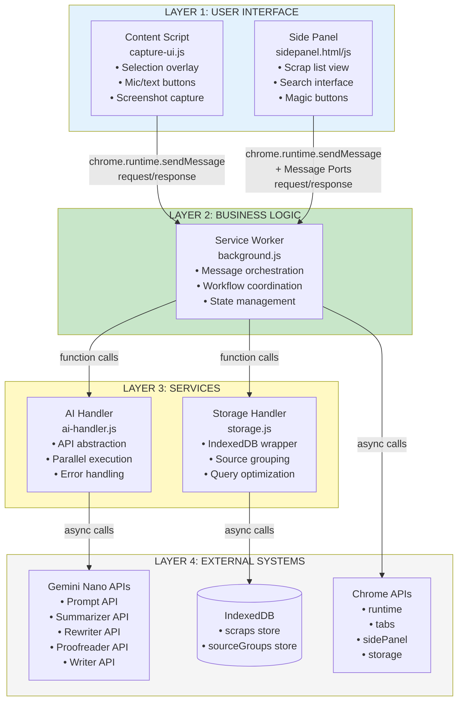

# Component Architecture Diagram

This diagram shows the detailed component structure of the Recall Chrome Extension with communication patterns across all four architectural layers.

## Component Details

### Layer 1: User Interface (Blue)
- **Content Script**: Injected into web pages for content capture
- **Side Panel**: Chrome side panel UI for viewing and managing scraps

### Layer 2: Business Logic (Green)
- **Service Worker**: Central orchestrator managing all extension workflows

### Layer 3: Services (Yellow)
- **AI Handler**: Abstraction layer for Gemini Nano API interactions
- **Storage Handler**: IndexedDB wrapper with source grouping logic

### Layer 4: External Systems (Gray)
- **Gemini Nano APIs**: Chrome's built-in AI capabilities
- **IndexedDB**: Browser-based local storage
- **Chrome APIs**: Extension platform APIs

## Communication Patterns

1. **chrome.runtime.sendMessage**: Request/response pattern between Content Script/Side Panel and Service Worker
2. **Message Ports**: Real-time bidirectional communication for Side Panel updates
3. **Function Calls**: Synchronous service invocation within Service Worker
4. **Async Calls**: Asynchronous operations to external systems

## Requirements Coverage

This diagram addresses:
- **Requirement 7.1**: Content Script to Service Worker communication using chrome.runtime.sendMessage
- **Requirement 7.2**: Service Worker to Side Panel communication using chrome.runtime.sendMessage and message ports
- **Requirement 7.5**: Structured message types with action and payload properties for inter-component communication
