# Capture Flow Sequence Diagram

This sequence diagram illustrates the complete user interaction flow from Alt+Drag selection to final storage, including parallel AI processing with multi-perspective image analysis.

```mermaid
sequenceDiagram
    actor User
    participant CS as Content Script<br/>(capture-ui.js)
    participant SW as Service Worker<br/>(background.js)
    participant AIH as AI Handler<br/>(ai-handler.js)
    participant STH as Storage Handler<br/>(storage.js)
    participant NANO as Gemini Nano<br/>(Chrome AI APIs)
    participant IDB as IndexedDB<br/>(VocalContextDB)
    
    Note over User,IDB: PHASE 1: CONTENT SELECTION & CAPTURE
    
    User->>CS: Press Alt + Drag mouse
    activate CS
    Note right of CS: 50ms: Inject overlay
    CS->>CS: Show selection rectangle overlay
    CS->>CS: Update rectangle on mouse move (60fps)
    
    User->>CS: Release mouse button
    Note right of CS: 100ms: Show buttons
    CS->>CS: Lock selection region
    CS->>CS: Capture screenshot (Canvas API)
    CS->>CS: Extract text from selected region
    Note right of CS: Automatic capture complete<br/>before buttons appear
    CS->>User: Display mic & text note buttons
    deactivate CS
    
    alt User chooses voice annotation
        User->>CS: Click microphone button
        activate CS
        CS->>CS: Request microphone permission
        alt Permission granted
            Note right of CS: 200ms: Start recording
            CS->>User: Show recording indicator
            User->>CS: Speak annotation
            User->>CS: Click stop button
            CS->>CS: Stop recording, save audio blob
        else Permission denied
            CS->>User: Show error: "Mic denied, use text note"
            Note right of CS: Graceful degradation:<br/>Allow text input instead
        end
        deactivate CS
    else User chooses text annotation
        User->>CS: Click text note button
        activate CS
        Note right of CS: 100ms: Show input field
        CS->>User: Display text input field
        User->>CS: Type annotation
        User->>CS: Click save button
        deactivate CS
    end
    
    Note over User,IDB: PHASE 2: SEND TO SERVICE WORKER
    
    activate CS
    Note right of CS: 500ms: Package data
    CS->>SW: sendMessage(CAPTURE_COMPLETE)<br/>{screenshot, selectedText, selectedRegion,<br/>audioBlob/textNote, metadata}
    deactivate CS
    
    activate SW
    Note right of SW: Orchestrate AI processing
    
    Note over User,IDB: PHASE 3: PARALLEL AI PROCESSING (Promise.all)
    
    par Audio Transcription (if audio exists)
        SW->>AIH: transcribeAudio(audioBlob)
        activate AIH
        AIH->>AIH: Check rate limit queue (max 3 concurrent)
        AIH->>NANO: Prompt API with audio input
        activate NANO
        Note right of NANO: 3s: Transcribe audio
        NANO-->>AIH: transcription text
        deactivate NANO
        AIH-->>SW: transcription
        deactivate AIH
    and Text Summarization (if text > 100 chars)
        SW->>AIH: summarizeText(selectedText)
        activate AIH
        AIH->>AIH: Check rate limit queue
        AIH->>NANO: Summarizer API
        activate NANO
        Note right of NANO: 2s: Generate summary
        NANO-->>AIH: summary text
        deactivate NANO
        AIH-->>SW: summary
        deactivate AIH
    and Multi-Perspective Image Analysis (always)
        SW->>AIH: analyzeImageContent(screenshot)
        activate AIH
        Note right of AIH: STEP 1: Content Classification
        AIH->>AIH: Check rate limit queue
        AIH->>NANO: Prompt API: Classify content types
        activate NANO
        Note right of NANO: 1s: Identify content types<br/>(text, code, chart, table, etc.)
        NANO-->>AIH: contentTypes: ['code', 'chart']
        deactivate NANO
        
        Note right of AIH: STEP 2: Conditional Deep Analysis<br/>(Parallel execution)
        
        par Code Analysis (if 'code' detected)
            AIH->>NANO: Prompt API: Analyze code
            activate NANO
            Note right of NANO: 2s: Language, purpose, functions
            NANO-->>AIH: codeAnalysis
            deactivate NANO
        and Chart Analysis (if 'chart'/'graph' detected)
            AIH->>NANO: Prompt API: Analyze chart
            activate NANO
            Note right of NANO: 2s: Type, axes, trends, insights
            NANO-->>AIH: chartAnalysis
            deactivate NANO
        and Table Analysis (if 'table' detected)
            AIH->>NANO: Prompt API: Analyze table
            activate NANO
            Note right of NANO: 2s: Columns, rows, data points
            NANO-->>AIH: tableAnalysis
            deactivate NANO
        and General Description (always)
            AIH->>NANO: Prompt API: General description
            activate NANO
            Note right of NANO: 1s: Concise description
            NANO-->>AIH: generalDescription
            deactivate NANO
        end
        
        AIH->>AIH: Combine results into ImageAnalysis object
        AIH-->>SW: imageAnalysis {contentTypes, codeAnalysis,<br/>chartAnalysis, tableAnalysis, generalDescription}
        deactivate AIH
    end
    
    Note right of SW: Wait for all branches<br/>(continue with partial data if any fail)
    
    alt Any AI processing fails
        Note right of SW: Error handling: Store null for failed operations<br/>Mark processingErrors, continue with partial data
    end
    
    Note over User,IDB: PHASE 4: DATA PREPARATION & STORAGE
    
    SW->>SW: Create scrap object with all AI results
    Note right of SW: Generate unique ID:<br/>scrap_timestamp_random
    
    SW->>SW: Generate thumbnail (200x150px)
    Note right of SW: Canvas resize for performance
    
    SW->>STH: getOrCreateSourceGroup(url)
    activate STH
    STH->>IDB: Query sourceGroups by URL
    activate IDB
    alt Source group exists
        IDB-->>STH: Existing group
    else New source
        STH->>STH: Create new source group
        STH->>IDB: Save new sourceGroups entry
        IDB-->>STH: Confirm save
    end
    deactivate IDB
    STH-->>SW: sourceGroupId
    deactivate STH
    
    SW->>SW: Add sourceGroupId to scrap
    
    SW->>STH: saveScrap(scrapData)
    activate STH
    STH->>STH: Check storage quota (warn if >90%)
    STH->>IDB: Save to scraps store
    activate IDB
    alt Storage successful
        IDB-->>STH: Confirm save
    else Quota exceeded
        IDB-->>STH: QuotaExceededError
        Note right of STH: Error: Offer JSON export
    end
    deactivate IDB
    
    STH->>IDB: Update sourceGroups (add scrapId, update lastCaptured)
    activate IDB
    IDB-->>STH: Confirm update
    deactivate IDB
    
    STH-->>SW: scrapId
    deactivate STH
    
    Note over User,IDB: PHASE 5: BROADCAST & RESPONSE
    
    SW->>SP: broadcast(SCRAP_CREATED, {scrapId})
    Note right of SW: 100ms: Notify all open Side Panels
    
    SW-->>CS: sendResponse({success: true, scrapId})
    deactivate SW
    
    activate CS
    CS->>User: Show success notification ✓
    Note right of CS: 2s: Auto-dismiss<br/>Cleanup DOM & listeners
    CS->>CS: Transition to IDLE state
    deactivate CS
    
    Note over User,IDB: ERROR HANDLING PATHS
    
    rect rgb(255, 230, 230)
        Note over CS,SW: Error Path 1: Microphone Permission Denied
        CS->>User: Show error message
        CS->>CS: Allow text note as fallback
    end
    
    rect rgb(255, 230, 230)
        Note over SW,NANO: Error Path 2: AI API Unavailable
        AIH->>SW: Return null for failed operations
        SW->>SW: Save scrap with partial data
        SW->>User: Notification: "Saved with partial processing"
    end
    
    rect rgb(255, 230, 230)
        Note over SW,IDB: Error Path 3: Storage Failure
        STH->>SW: Throw error
        SW->>User: Notification: "Storage failed, export as JSON?"
    end
    
    rect rgb(255, 230, 230)
        Note over CS,SW: Error Path 4: Message Timeout (10s)
        SW-->>CS: Timeout error
        CS->>User: Show error with retry option
    end
```

## Key Timing Annotations

- **50ms**: Selection overlay injection
- **100ms**: Mic/text buttons display after mouse release
- **200ms**: Microphone recording start
- **500ms**: Data packaging before sending to Service Worker
- **1s**: Content type classification (Step 1 of image analysis)
- **2s**: Individual specialized analyses (code, chart, table)
- **3s**: Audio transcription, text summarization
- **Total AI Processing**: ~3-5s (parallel execution)
- **100ms**: Broadcast to Side Panels
- **2s**: Success notification auto-dismiss

## Automatic Capture Behavior

When the user releases the mouse button (MouseUp event), the Content Script **automatically** performs:

1. **Screenshot Capture**: Uses Canvas API to capture the visual representation of the selected region
2. **Text Extraction**: Extracts DOM text content from elements within the selected region

Both operations complete **before** the microphone/text buttons appear, ensuring all content is ready when the user chooses their annotation method.

## Multi-Perspective Image Analysis Flow

The image analysis uses a **two-phase approach** to optimize performance:

**Phase 1: Content Type Classification** (1 API call, ~1s)
- Identifies ALL content types present: text, code, chart, graph, table, diagram, photo, UI

**Phase 2: Conditional Deep Analysis** (parallel API calls, ~2s each)
- **IF** 'code' detected → Code Analysis (language, purpose, functions)
- **IF** 'chart'/'graph' detected → Chart Analysis (type, axes, trends)
- **IF** 'table' detected → Table Analysis (columns, rows, data)
- **ALWAYS** → General Description (fallback)

This approach minimizes API calls while maximizing insight depth based on actual content.

## Error Handling Strategy

All error paths follow **graceful degradation**:
- AI failures → Save with partial data, mark errors
- Permission denied → Offer alternative input method
- Storage full → Offer JSON export
- Timeout → Show retry option

No error blocks the core capture workflow. Users never lose their captured content.

## Requirements Coverage

This diagram addresses:
- **Requirements 1.1-1.6**: Universal content capture with Alt+Drag, automatic screenshot/text extraction
- **Requirements 2.1-2.5**: Parallel AI processing (audio, text, image) with error handling
- **Requirements 11.1-11.7**: Multi-perspective multimodal image analysis with content type detection and conditional specialized analyses
