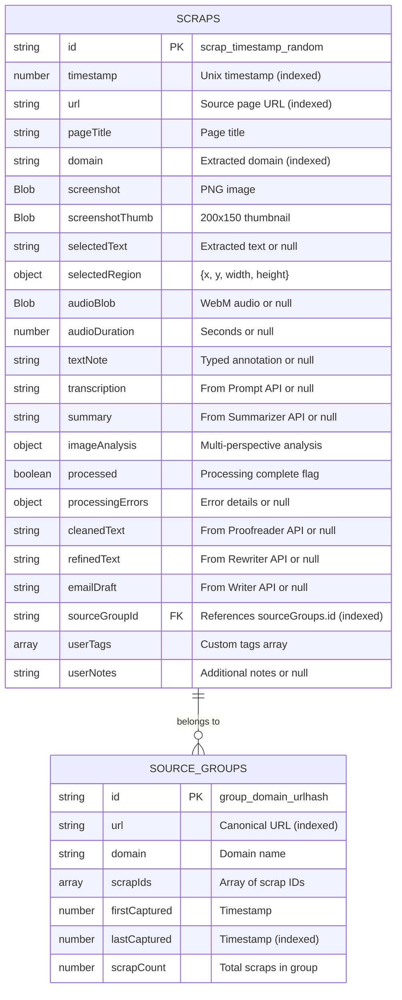

# Data Model Schema (ERD)

This entity-relationship diagram defines the complete IndexedDB structure for the Recall Chrome extension, showing both object stores, their fields with data types, indexes, and relationships.

## Diagram



## ImageAnalysis Nested Structure

The `imageAnalysis` field in the SCRAPS store contains a nested object with the following structure:

```javascript
imageAnalysis: {
  contentTypes: string[],           // Array of detected types: 'text', 'code', 'chart', 'graph', 'table', 'diagram', 'photo', 'UI', 'other'
  codeAnalysis: string | undefined, // Present only if 'code' detected: language, purpose, key functions
  chartAnalysis: string | undefined,// Present only if 'chart'/'graph' detected: type, axes, trends, insights
  tableAnalysis: string | undefined,// Present only if 'table' detected: columns, rows, notable data
  generalDescription: string        // Always present: fallback description
}
```

## Indexes

### SCRAPS Object Store
- **Primary Key**: `id` (unique identifier: `scrap_${timestamp}_${random}`)
- **Index**: `timestamp` - For chronological sorting and date range queries
- **Index**: `url` - For source grouping queries and finding related scraps
- **Index**: `domain` - For domain-based filtering and analytics
- **Index**: `sourceGroupId` - For efficient collection queries and group retrieval

### SOURCE_GROUPS Object Store
- **Primary Key**: `id` (unique identifier: `group_${domain}_${urlhash}`)
- **Index**: `url` - For fast lookup when checking if group exists
- **Index**: `lastCaptured` - For sorting by recent activity

## Relationships

### Many-to-One: SCRAPS → SOURCE_GROUPS
- Each scrap belongs to exactly one source group (via `sourceGroupId` foreign key)
- Each source group can contain multiple scraps (tracked in `scrapIds` array)
- Bidirectional linking: scraps reference groups, groups reference scraps
- Automatic grouping: when a scrap is saved, the system checks if a group exists for that URL
  - If yes: add scrap ID to existing group's `scrapIds` array
  - If no: create new group with initial scrap ID

## Data Type Details

| Field | Type | Size Estimate | Notes |
|-------|------|---------------|-------|
| screenshot | Blob | 100-500 KB | PNG format, variable based on selection size |
| screenshotThumb | Blob | 5-15 KB | 200x150px thumbnail for list view performance |
| audioBlob | Blob | 50-500 KB/min | WebM format, optional |
| selectedText | string | 0-50 KB | Extracted DOM text, optional |
| transcription | string | 0-10 KB | AI-generated, optional |
| summary | string | 0-2 KB | AI-generated, optional |
| imageAnalysis | object | 0.5-3 KB | Multi-perspective analysis with conditional fields |
| cleanedText | string | 0-10 KB | Proofreader API result, optional |
| refinedText | string | 0-10 KB | Rewriter API result, optional |
| emailDraft | string | 0-5 KB | Writer API result, optional |

**Total per scrap**: ~200 KB - 2 MB (depending on audio duration and image size)

## Storage Quota Management

- **Warning threshold**: 100 MB remaining
- **Recommended max scraps**: 500-1000 (depending on content)
- **Cleanup strategy**: Export old scraps as JSON, offer deletion of oldest items
- **Fallback**: chrome.storage.local if IndexedDB fails (limited to 10 MB)

## Query Patterns

### Common Queries
1. **Get all scraps (chronological)**: Query by `timestamp` index, descending
2. **Get scraps by domain**: Query by `domain` index
3. **Get source group**: Query by `sourceGroupId` index
4. **Find group by URL**: Query SOURCE_GROUPS by `url` index
5. **Recent activity**: Query SOURCE_GROUPS by `lastCaptured` index

### Performance Considerations
- Virtual scrolling for lists > 50 items
- Lazy load thumbnails using IntersectionObserver
- Limit initial load to 100 most recent scraps
- Use cursor-based pagination for large datasets
- Cache frequently accessed groups in memory (5-minute TTL)

## Requirements Mapping

This schema satisfies the following requirements:

- **3.1**: All scrap data stored in IndexedDB within browser profile
- **3.2**: Unique identifier generation using timestamp and random string
- **3.3**: Automatic URL-based linking with bidirectional references
- **3.4**: Thumbnail generation at 200x150 pixels
- **3.5**: Blob storage for audio/screenshots, string storage for text
- **3.6**: Storage quota warning at 100 MB threshold
- **3.7**: Separate sourceGroups index for efficient URL-based organization
- **11.1-11.6**: Multi-perspective image analysis with nested structure supporting content type classification and conditional specialized analyses
```
