# Capture UI State Machine Diagram

This state machine defines the complete behavior of the Content Script UI during the capture workflow, showing all 8 states, transitions, timeouts, and error recovery paths.

## State Machine

```mermaid
stateDiagram-v2
    [*] --> IDLE : Extension loaded
    
    IDLE --> SELECTING : Alt + MouseDown
    
    SELECTING --> IDLE : Esc pressed
    SELECTING --> READY : MouseUp<br/>(auto-capture screenshot + text)
    
    READY --> IDLE : Click outside region
    READY --> IDLE : Esc pressed
    READY --> RECORDING : Click microphone button
    READY --> TYPING : Click text note button
    
    RECORDING --> READY : Microphone permission denied
    RECORDING --> PROCESSING : Click stop button
    RECORDING --> PROCESSING : 5 minute timeout<br/>(auto-stop)
    
    TYPING --> PROCESSING : Click save button
    TYPING --> READY : Esc pressed<br/>(discard text)
    
    PROCESSING --> COMPLETE : Service Worker confirms save<br/>(success response)
    PROCESSING --> ERROR : Service Worker returns error
    PROCESSING --> ERROR : 10 second timeout<br/>(no response)
    
    COMPLETE --> IDLE : 2 second auto-transition<br/>(cleanup UI)
    
    ERROR --> READY : Click retry button<br/>(restore capture state)
    ERROR --> IDLE : Click cancel button<br/>(discard capture)
    
    note right of IDLE
        <b>Initial State</b>
        • No UI visible
        • Listening for Alt key
        • Clean DOM state
        • Event listeners attached
    end note
    
    note right of SELECTING
        <b>Active Selection</b>
        • Selection rectangle visible
        • Updates on mouse move (60fps)
        • Dims rest of page (overlay)
        • Shows coordinates in real-time
        • Can cancel with Esc
    end note
    
    note right of READY
        <b>Awaiting Annotation</b>
        • Selection locked (frozen)
        • Screenshot captured (Blob)
        • Text extracted (string)
        • Mic & text buttons visible
        • Buttons positioned at bottom-right
        • User chooses annotation method
    end note
    
    note right of RECORDING
        <b>Audio Recording</b>
        • Red recording indicator
        • Waveform visualization
        • Timer counting up (MM:SS)
        • Stop button enabled
        • Max duration: 5 minutes
        • Audio stored as WebM Blob
    end note
    
    note right of TYPING
        <b>Text Input</b>
        • Text input field visible
        • Character counter (0/500)
        • Save button enabled when text > 0
        • Can cancel with Esc
        • Autofocus on input field
    end note
    
    note right of PROCESSING
        <b>Sending to Background</b>
        • Loading spinner animation
        • "Processing..." message
        • All buttons disabled
        • Sends CAPTURE_COMPLETE message
        • Waits for response (max 10s)
        • Cannot cancel during processing
    end note
    
    note right of COMPLETE
        <b>Success State</b>
        • Green checkmark icon
        • "Scrap saved!" message
        • Brief success animation
        • Auto-cleanup after 2 seconds
        • Removes all DOM elements
        • Clears event listeners
    end note
    
    note right of ERROR
        <b>Failure State</b>
        • Red error icon
        • Error message displayed
        • Retry button (returns to READY)
        • Cancel button (returns to IDLE)
        • Preserves captured data for retry
        • Shows specific error reason
    end note
```



## State Descriptions

### IDLE
**Purpose**: Default state when no capture is in progress.

**Characteristics**:
- No UI elements visible
- Global keyboard listener active (Alt key detection)
- Minimal memory footprint
- Ready to initiate capture

**Entry Actions**:
- Remove all capture UI elements from DOM
- Clear all event listeners except Alt key listener
- Reset internal state variables
- Free memory (Blobs, audio streams)

**Exit Conditions**:
- User presses Alt + MouseDown → SELECTING

---

### SELECTING
**Purpose**: User is actively defining the capture region.

**Characteristics**:
- Selection rectangle rendered and updating
- Mouse move events tracked at 60fps
- Page dimmed with semi-transparent overlay
- Real-time coordinate display

**Entry Actions**:
- Create overlay div covering entire viewport
- Attach mousemove and mouseup listeners
- Initialize selection rectangle at mouse position
- Dim page content (opacity: 0.3)

**Exit Conditions**:
- User presses Esc → IDLE (cancel)
- User releases mouse → READY (confirm selection)

**Performance Notes**:
- Use `requestAnimationFrame` for smooth rendering
- Debounce mouse move events (16ms for 60fps)
- Use CSS transforms for rectangle positioning

---

### READY
**Purpose**: Selection confirmed, awaiting user's annotation choice.

**Characteristics**:
- Selection region frozen and highlighted
- Screenshot already captured (automatic)
- Text already extracted (automatic)
- Microphone and text note buttons visible

**Entry Actions**:
- **Automatically capture screenshot** using Canvas API
- **Automatically extract text** from selected DOM region
- Lock selection rectangle (no more updates)
- Display microphone button (bottom-right of selection)
- Display text note button (next to microphone)
- Attach click listeners to buttons
- Attach click-outside and Esc listeners for cancellation

**Exit Conditions**:
- User clicks microphone button → RECORDING
- User clicks text note button → TYPING
- User clicks outside region → IDLE (cancel)
- User presses Esc → IDLE (cancel)

**Data Captured**:
- `screenshot`: Blob (PNG)
- `selectedText`: string
- `selectedRegion`: {x, y, width, height}
- `metadata`: {url, pageTitle, domain, timestamp}

---

### RECORDING
**Purpose**: User is recording audio annotation.

**Characteristics**:
- Audio recording active via Web Audio API
- Visual feedback (waveform, timer)
- Stop button enabled
- Maximum duration enforced (5 minutes)

**Entry Actions**:
- Request microphone permission (if not granted)
- Initialize MediaRecorder with audio stream
- Start recording
- Display recording indicator (red dot)
- Start timer display (MM:SS format)
- Show waveform visualization
- Display stop button
- Set 5-minute timeout

**Exit Conditions**:
- User clicks stop button → PROCESSING
- 5-minute timeout reached → PROCESSING (auto-stop)
- Microphone permission denied → READY (show error, allow retry)

**Error Handling**:
- If permission denied: Show error message, return to READY state
- If recording fails: Show error, return to READY state
- Preserve screenshot and text data for retry

**Data Captured**:
- `audioBlob`: Blob (WebM)
- `audioDuration`: number (seconds)

---

### TYPING
**Purpose**: User is typing text annotation.

**Characteristics**:
- Text input field visible and focused
- Character counter displayed
- Save button enabled when text length > 0
- Can cancel with Esc

**Entry Actions**:
- Display text input field (textarea)
- Autofocus on input field
- Display character counter (0/500)
- Display save button (initially disabled)
- Attach input listener to enable/disable save button
- Attach Esc listener for cancellation

**Exit Conditions**:
- User clicks save button → PROCESSING
- User presses Esc → READY (discard text, return to button choice)

**Validation**:
- Minimum length: 1 character
- Maximum length: 500 characters (soft limit, not enforced)
- Save button disabled when text is empty

**Data Captured**:
- `textNote`: string

---

### PROCESSING
**Purpose**: Sending captured data to Service Worker for AI processing.

**Characteristics**:
- Loading spinner visible
- All buttons disabled
- Cannot cancel
- Timeout enforced (10 seconds)

**Entry Actions**:
- Display loading spinner
- Show "Processing..." message
- Disable all buttons
- Send `CAPTURE_COMPLETE` message to Service Worker
- Set 10-second timeout for response
- Wait for response via `chrome.runtime.sendMessage` callback

**Exit Conditions**:
- Service Worker responds with success → COMPLETE
- Service Worker responds with error → ERROR
- 10-second timeout (no response) → ERROR

**Message Sent**:
```javascript
{
  type: 'CAPTURE_COMPLETE',
  payload: {
    screenshot: Blob,
    selectedText: string,
    selectedRegion: {x, y, width, height},
    audioBlob?: Blob,
    textNote?: string,
    metadata: {url, pageTitle, domain, timestamp}
  }
}
```

**Expected Response**:
```javascript
{
  success: boolean,
  scrapId?: string,
  error?: string
}
```

---

### COMPLETE
**Purpose**: Capture successfully saved, showing success feedback.

**Characteristics**:
- Success checkmark icon
- "Scrap saved!" message
- Brief animation
- Auto-cleanup after 2 seconds

**Entry Actions**:
- Display green checkmark icon
- Show "Scrap saved!" message
- Play success animation (fade in)
- Set 2-second timer for auto-transition

**Exit Conditions**:
- 2-second timer expires → IDLE (automatic cleanup)

**Cleanup Actions**:
- Remove all UI elements from DOM
- Clear all event listeners
- Free memory (Blobs, audio streams)
- Reset state variables
- Return to IDLE state

---

### ERROR
**Purpose**: Capture failed, showing error and recovery options.

**Characteristics**:
- Red error icon
- Specific error message
- Retry button (preserves data)
- Cancel button (discards data)

**Entry Actions**:
- Display red error icon
- Show error message (from Service Worker or timeout)
- Display retry button
- Display cancel button
- Preserve all captured data (screenshot, text, audio)

**Exit Conditions**:
- User clicks retry button → READY (restore capture state, allow re-annotation)
- User clicks cancel button → IDLE (discard all data, cleanup)

**Error Messages**:
- "Processing timeout. Please try again."
- "Failed to save scrap: [error reason]"
- "AI processing unavailable. Scrap saved with raw data."
- "Storage quota exceeded. Please free up space."

**Recovery Strategy**:
- Retry: Return to READY state with all data preserved
- User can choose different annotation method
- User can cancel and start fresh

---

## Transition Details

### Critical Transitions

#### SELECTING → READY (MouseUp)
**Automatic Capture Operations**:
1. **Screenshot Capture** (Canvas API):
   ```javascript
   const canvas = document.createElement('canvas');
   canvas.width = region.width;
   canvas.height = region.height;
   const ctx = canvas.getContext('2d');
   ctx.drawImage(document.documentElement, 
     region.x, region.y, region.width, region.height,
     0, 0, region.width, region.height);
   const screenshot = await canvas.toBlob('image/png');
   ```

2. **Text Extraction** (DOM traversal):
   ```javascript
   const walker = document.createTreeWalker(
     document.body,
     NodeFilter.SHOW_TEXT,
     {
       acceptNode: (node) => {
         const rect = node.parentElement.getBoundingClientRect();
         return intersects(rect, region) ? 
           NodeFilter.FILTER_ACCEPT : 
           NodeFilter.FILTER_REJECT;
       }
     }
   );
   let text = '';
   while (walker.nextNode()) {
     text += walker.currentNode.textContent + ' ';
   }
   const selectedText = text.trim();
   ```

**Timing**: Both operations complete within 100ms before buttons appear.

#### RECORDING → PROCESSING (5-minute timeout)
**Auto-stop Behavior**:
- Timer reaches 5:00 (300 seconds)
- Automatically stop recording
- Finalize audio Blob
- Transition to PROCESSING state
- Show notification: "Recording stopped (5 min limit)"

#### PROCESSING → ERROR (10-second timeout)
**Timeout Handling**:
- No response from Service Worker after 10 seconds
- Assume processing failed
- Transition to ERROR state
- Show message: "Processing timeout. Please try again."
- Preserve all captured data for retry

---

## Performance Considerations

### State Transition Timing
- IDLE → SELECTING: < 50ms (overlay injection)
- SELECTING → READY: < 100ms (screenshot + text extraction)
- READY → RECORDING: < 200ms (microphone initialization)
- READY → TYPING: < 100ms (input field display)
- PROCESSING → COMPLETE: < 10s (Service Worker processing)
- COMPLETE → IDLE: 2s (auto-cleanup)

### Memory Management
- **IDLE**: Minimal footprint (~1KB)
- **SELECTING**: Overlay + listeners (~50KB)
- **READY**: + Screenshot Blob (~500KB - 2MB)
- **RECORDING**: + Audio stream (~100KB/min)
- **PROCESSING**: Peak memory (all data in flight)
- **COMPLETE/ERROR**: Cleanup within 100ms

### DOM Cleanup
All states must clean up properly:
- Remove injected elements
- Clear event listeners
- Stop media streams
- Revoke Blob URLs
- Reset CSS modifications

---

## Error Recovery Paths

### Microphone Permission Denied
```
RECORDING → READY
- Show error: "Microphone access denied"
- Preserve screenshot and text
- Allow user to choose text note instead
```

### AI Processing Failure
```
PROCESSING → ERROR → READY (retry)
- Preserve all captured data
- User can re-annotate or cancel
- Service Worker saves with partial data
```

### Storage Quota Exceeded
```
PROCESSING → ERROR
- Show error: "Storage full"
- Offer export option
- Cancel button returns to IDLE
```

### Network/API Timeout
```
PROCESSING → ERROR (10s timeout)
- Show error: "Processing timeout"
- Retry button returns to READY
- All data preserved for retry
```

---

## Requirements Mapping

This state machine satisfies the following requirements:

**Requirement 1.1**: Alt + MouseDown triggers IDLE → SELECTING within 50ms
**Requirement 1.2**: Mouse drag updates selection at 60fps in SELECTING state
**Requirement 1.3**: MouseUp displays buttons within 100ms (SELECTING → READY)
**Requirement 1.4**: Microphone button initiates recording within 200ms (READY → RECORDING)
**Requirement 1.5**: Text note button displays input within 100ms (READY → TYPING)
**Requirement 1.6**: Automatic screenshot and text capture in READY state within 500ms

**Requirement 9.1**: Microphone permission denied handled with RECORDING → READY transition
**Requirement 9.2**: AI API unavailable handled in PROCESSING → ERROR transition
**Requirement 9.3**: Processing failure handled with ERROR state and retry option
**Requirement 9.4**: Exponential backoff implemented in Service Worker (not in state machine)
**Requirement 9.5**: Error logging without sensitive data exposure

---

## Implementation Notes

### State Storage
```javascript
class CaptureUIStateMachine {
  private state: State = 'IDLE';
  private capturedData: {
    screenshot?: Blob;
    selectedText?: string;
    selectedRegion?: Region;
    audioBlob?: Blob;
    textNote?: string;
    metadata?: Metadata;
  } = {};
  
  transition(newState: State) {
    console.log(`State transition: ${this.state} → ${newState}`);
    this.exitState(this.state);
    this.state = newState;
    this.enterState(newState);
  }
  
  enterState(state: State) {
    switch (state) {
      case 'IDLE': this.enterIdle(); break;
      case 'SELECTING': this.enterSelecting(); break;
      case 'READY': this.enterReady(); break;
      case 'RECORDING': this.enterRecording(); break;
      case 'TYPING': this.enterTyping(); break;
      case 'PROCESSING': this.enterProcessing(); break;
      case 'COMPLETE': this.enterComplete(); break;
      case 'ERROR': this.enterError(); break;
    }
  }
  
  exitState(state: State) {
    // Cleanup logic for each state
  }
}
```

### Testing Checklist
- [ ] All 8 states are reachable
- [ ] All transitions work correctly
- [ ] Timeouts trigger properly (5 min, 10s, 2s)
- [ ] Error recovery paths function
- [ ] Memory cleanup occurs in all exit paths
- [ ] DOM elements removed properly
- [ ] Event listeners cleared
- [ ] Blobs and streams released

