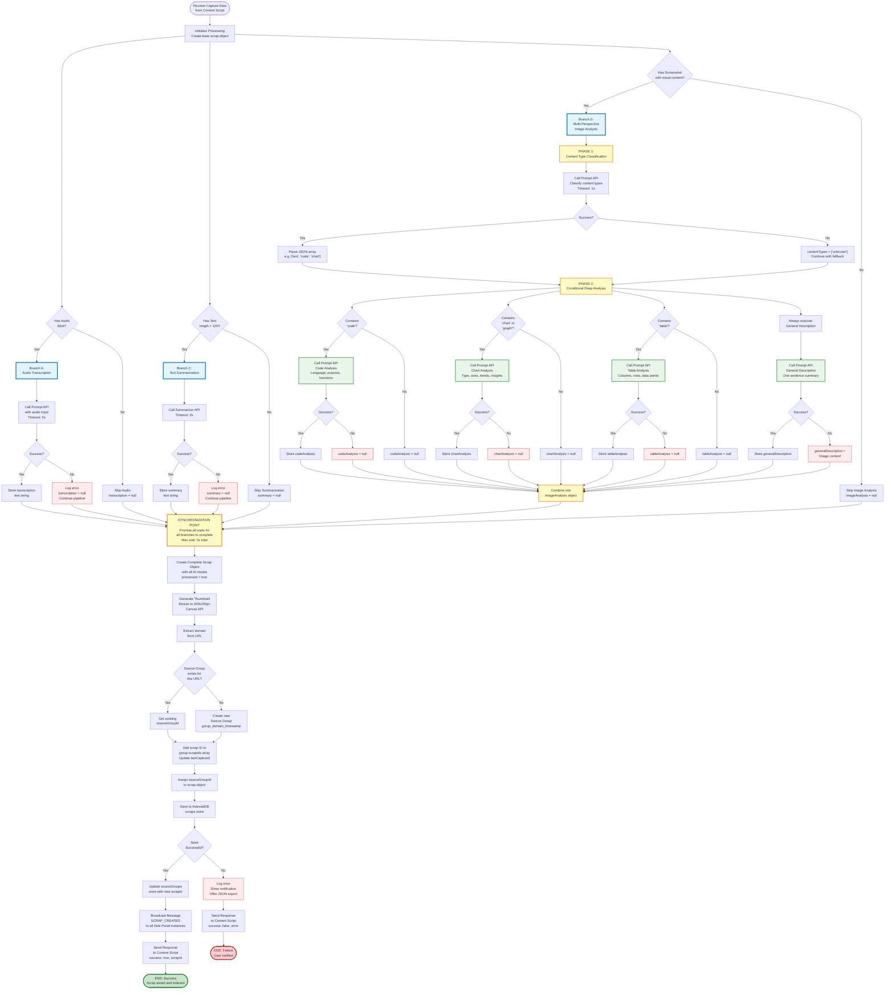

# AI Processing Pipeline Flowchart

This flowchart details the complete AI processing logic in the Service Worker, showing parallel execution branches, multi-perspective image analysis, error handling, and storage operations.

## Key Features Highlighted

- **Parallel Processing**: Audio, text, and image processing happen simultaneously
- **Multi-Perspective Image Analysis**: Two-phase approach with content classification and conditional specialized analysis
- **Error Resilience**: Each branch handles failures independently without blocking the pipeline
- **Source Grouping**: Automatic linking of scraps from the same URL
- **Performance**: Promise.all synchronization for optimal speed

---

## Complete AI Processing Pipeline



---

## Performance Metrics

### Processing Time Budgets

| Scenario | Expected Time | Components |
|----------|--------------|------------|
| **Audio Only** | ~3s | Audio transcription (3s) |
| **Text Only** | ~2s | Text summarization (2s) |
| **Image Only (Simple)** | ~2s | Classification (1s) + General desc (1s) |
| **Image with Code** | ~3s | Classification (1s) + Code analysis (1s) + General desc (1s) |
| **Image with Chart** | ~3s | Classification (1s) + Chart analysis (1s) + General desc (1s) |
| **Image with Code + Chart** | ~4s | Classification (1s) + Code (1s) + Chart (1s) + General desc (1s) |
| **Full Capture** | ~5s | Audio (3s) + Text (2s) + Image (3s) in parallel = max(3,2,3) = 3s + processing overhead |

### Multi-Perspective Image Analysis Optimization

The two-phase approach minimizes API calls:

1. **Phase 1 (Classification)**: Single API call (~1s)
   - Identifies all content types present
   - Returns JSON array: `["text", "code", "chart"]`

2. **Phase 2 (Conditional Analysis)**: Only analyze what's detected
   - If no code detected → Skip code analysis (saves ~1s)
   - If no chart detected → Skip chart analysis (saves ~1s)
   - If no table detected → Skip table analysis (saves ~1s)
   - Always run general description (fallback)

**Example Savings**:
- Pure text image: 1 classification + 1 general = 2 API calls (~2s)
- Code + chart image: 1 classification + 2 specialized + 1 general = 4 API calls (~4s)
- Without optimization: Always 5 API calls regardless of content (~5s)

---

## Error Handling Strategy

### Graceful Degradation

Each processing branch handles errors independently:

1. **Audio Transcription Fails**
   - Store `transcription = null`
   - Continue with text and image processing
   - User can still see screenshot and text

2. **Text Summarization Fails**
   - Store `summary = null`
   - Continue with audio and image processing
   - User can still see original text

3. **Image Analysis Fails**
   - Store minimal ImageAnalysis object:
     ```javascript
     {
       contentTypes: ['unknown'],
       generalDescription: 'Image analysis unavailable'
     }
     ```
   - Continue with audio and text processing
   - User can still see screenshot thumbnail

4. **All AI Processing Fails**
   - Save scrap with raw data only
   - Set `processed = false`
   - Store error details in `processingErrors` object
   - Show retry option in Side Panel UI

### Retry Logic

For transient failures (network timeouts, API rate limits):

```javascript
async function retryWithBackoff(fn, maxAttempts = 3) {
  for (let attempt = 1; attempt <= maxAttempts; attempt++) {
    try {
      return await fn();
    } catch (error) {
      if (attempt === maxAttempts) throw error;
      
      const delay = Math.pow(2, attempt - 1) * 1000; // 1s, 2s, 4s
      await new Promise(resolve => setTimeout(resolve, delay));
    }
  }
}
```

---

## Source Grouping Logic

### Automatic URL-Based Linking

When a scrap is saved, the system automatically:

1. **Extract Domain**: Parse URL to get domain (e.g., `github.com`)
2. **Check Existing Group**: Query `sourceGroups` store by URL
3. **Create or Update**:
   - If group exists: Add scrap ID to `scrapIds` array, update `lastCaptured`
   - If new: Create group with `id = group_domain_timestamp`
4. **Bidirectional Link**: Store `sourceGroupId` in scrap object

### Benefits

- **Contextual Recall**: See all thoughts on a particular article/page
- **Temporal Tracking**: Know when you first and last captured from a source
- **Efficient Queries**: Use `sourceGroupId` index for fast retrieval
- **UI Enhancement**: Show "View Source Group" button with count badge

---

## Requirements Coverage

This diagram satisfies the following requirements:

- **2.1**: Audio transcription using Prompt API (Branch A)
- **2.2**: Text summarization using Summarizer API (Branch C)
- **2.3**: Image analysis using Prompt API multimodal (Branch D)
- **2.4**: Parallel execution with Promise.all (Synchronization Point)
- **2.5**: Error handling with partial data save (Error branches)
- **11.1**: Content type classification (Phase 1)
- **11.2**: Conditional specialized analysis (Phase 2 decision tree)
- **11.3**: Code analysis for programming content
- **11.4**: Chart analysis for data visualizations
- **11.5**: Table analysis for tabular data
- **11.6**: General description fallback
- **11.7**: Parallel execution of specialized analyses

---

## Implementation Notes

### Rate Limiting

The AI Handler implements a queue to limit concurrent API calls:

```javascript
private requestQueue: Promise<any>[] = [];
private readonly MAX_CONCURRENT = 3; // Requirement 8.3

async queueRequest<T>(fn: () => Promise<T>): Promise<T> {
  while (this.requestQueue.length >= this.MAX_CONCURRENT) {
    await Promise.race(this.requestQueue);
  }
  
  const promise = fn();
  this.requestQueue.push(promise);
  
  promise.finally(() => {
    const index = this.requestQueue.indexOf(promise);
    if (index > -1) this.requestQueue.splice(index, 1);
  });
  
  return promise;
}
```

### Session Caching

AI sessions are cached for 5 minutes to reduce initialization overhead:

```javascript
private sessions: Map<string, any> = new Map();
private sessionTimestamps: Map<string, number> = new Map();
private readonly SESSION_TIMEOUT = 300000; // 5 minutes

async getSession(type: string, creator: () => Promise<any>) {
  this.cleanupStaleSessions();
  
  if (!this.sessions.has(type)) {
    const session = await creator();
    this.sessions.set(type, session);
    this.sessionTimestamps.set(type, Date.now());
  }
  
  this.sessionTimestamps.set(type, Date.now());
  return this.sessions.get(type);
}
```

### Memory Cleanup

After processing completes, the Service Worker cleans up:

```javascript
async function cleanupAfterCapture() {
  // Release blob URLs
  URL.revokeObjectURL(screenshotUrl);
  URL.revokeObjectURL(audioUrl);
  
  // Clear temporary data
  tempData = null;
  
  // Force garbage collection hint
  if (global.gc) global.gc();
}
```

---

## Hackathon Differentiator

The **Multi-Perspective Image Analysis** (Branch D, Phase 2) is the key innovation:

- **Smart**: Only analyzes what's actually in the image
- **Fast**: Parallel execution of specialized analyses
- **Comprehensive**: Covers code, charts, tables, and general content
- **Efficient**: Saves API calls by skipping irrelevant analyses
- **Robust**: Always provides general description as fallback

This demonstrates sophisticated use of Chrome's multimodal AI capabilities beyond simple image captioning.
