# Message Flow Diagram

This diagram illustrates all inter-component communication patterns in the Recall Chrome extension, showing message types, request-response pairs, broadcast patterns, timeouts, and payload structures.

## Complete Message Flow with Swimlanes

```mermaid
sequenceDiagram
    participant CS as Content Script<br/>(capture-ui.js)
    participant SW as Service Worker<br/>(background.js)
    participant SP1 as Side Panel Instance 1<br/>(sidepanel.js)
    participant SP2 as Side Panel Instance 2<br/>(sidepanel.js)
    participant STH as Storage Handler<br/>(storage.js)
    
    rect rgb(230, 240, 255)
        Note over CS,STH: MESSAGE TYPE 1: CAPTURE_COMPLETE
        CS->>SW: sendMessage(CAPTURE_COMPLETE)
        Note right of CS: Payload:<br/>{<br/>  screenshot: Blob,<br/>  selectedText: string,<br/>  selectedRegion: {x, y, w, h},<br/>  audioBlob?: Blob,<br/>  textNote?: string,<br/>  metadata: {<br/>    url, pageTitle,<br/>    domain, timestamp<br/>  }<br/>}
        SW->>SW: Process with AI Handler<br/>(transcribe, summarize, analyze)
        SW->>STH: saveScrap()
        STH-->>SW: scrapId
        SW-->>CS: response({success, scrapId})
        Note left of SW: Timeout: 10s<br/>Response:<br/>{<br/>  success: boolean,<br/>  scrapId?: string,<br/>  error?: string<br/>}
    end
    
    rect rgb(240, 255, 240)
        Note over CS,STH: MESSAGE TYPE 2: SCRAP_SAVED (Broadcast)
        SW->>SP1: broadcast(SCRAP_SAVED)
        SW->>SP2: broadcast(SCRAP_SAVED)
        Note right of SW: Payload:<br/>{<br/>  type: 'SCRAP_SAVED',<br/>  scrapId: string,<br/>  timestamp: number<br/>}<br/><br/>Sent to ALL open<br/>Side Panel instances
        SP1->>SP1: Update UI<br/>Add new scrap card
        SP2->>SP2: Update UI<br/>Add new scrap card
    end
    
    rect rgb(255, 250, 230)
        Note over CS,STH: MESSAGE TYPE 3: GET_ALL_SCRAPS
        SP1->>SW: sendMessage(GET_ALL_SCRAPS)
        Note right of SP1: Payload:<br/>{<br/>  filters?: {<br/>    domain?: string,<br/>    dateRange?: {start, end}<br/>  },<br/>  sort?: {<br/>    field: string,<br/>    order: 'asc'|'desc'<br/>  }<br/>}
        SW->>STH: getAllScraps(filters, sort)
        STH-->>SW: Array<Scrap>
        SW-->>SP1: response(scraps)
        Note left of SW: Timeout: 5s<br/>Response:<br/>{<br/>  scraps: Array<Scrap>,<br/>  total: number<br/>}
    end
    
    rect rgb(255, 240, 245)
        Note over CS,STH: MESSAGE TYPE 4: CLEANUP_TEXT
        SP1->>SW: sendMessage(CLEANUP_TEXT)
        Note right of SP1: Payload:<br/>{<br/>  scrapId: string,<br/>  text: string<br/>}
        SW->>SW: Call Proofreader API<br/>(fix grammar & punctuation)
        SW->>STH: updateScrap(cleanedText)
        STH-->>SW: success
        SW-->>SP1: response({cleanedText})
        Note left of SW: Timeout: 10s<br/>Response:<br/>{<br/>  cleanedText: string,<br/>  success: boolean<br/>}
    end
    
    rect rgb(245, 240, 255)
        Note over CS,STH: MESSAGE TYPE 5: REFINE_TEXT
        SP1->>SW: sendMessage(REFINE_TEXT)
        Note right of SP1: Payload:<br/>{<br/>  scrapId: string,<br/>  text: string,<br/>  tone: 'formal'|<br/>        'casual'|<br/>        'professional'<br/>}
        SW->>SW: Call Rewriter API<br/>(adjust tone & style)
        SW->>STH: updateScrap(refinedText)
        STH-->>SW: success
        SW-->>SP1: response({refinedText})
        Note left of SW: Timeout: 10s<br/>Response:<br/>{<br/>  refinedText: string,<br/>  success: boolean<br/>}
    end
    
    rect rgb(255, 245, 230)
        Note over CS,STH: MESSAGE TYPE 6: DRAFT_EMAIL
        SP1->>SW: sendMessage(DRAFT_EMAIL)
        Note right of SP1: Payload:<br/>{<br/>  scrapId: string,<br/>  context: {<br/>    transcription?: string,<br/>    summary?: string,<br/>    imageAnalysis?: object,<br/>    pageTitle: string,<br/>    url: string<br/>  }<br/>}
        SW->>SW: Call Writer API<br/>(generate email)
        SW->>STH: updateScrap(emailDraft)
        STH-->>SW: success
        SW-->>SP1: response({emailDraft})
        Note left of SW: Timeout: 10s<br/>Response:<br/>{<br/>  emailDraft: {<br/>    subject: string,<br/>    body: string<br/>  },<br/>  success: boolean<br/>}
    end
    
    rect rgb(240, 255, 255)
        Note over CS,STH: MESSAGE TYPE 7: SEARCH_SCRAPS
        SP1->>SW: sendMessage(SEARCH_SCRAPS)
        Note right of SP1: Payload:<br/>{<br/>  query: string,<br/>  semanticSearch: boolean<br/>}
        SW->>STH: getAllScraps()
        STH-->>SW: Array<Scrap>
        SW->>SW: Call Prompt API<br/>(semantic matching)
        SW-->>SP1: response({results})
        Note left of SW: Timeout: 10s<br/>Response:<br/>{<br/>  results: Array<{<br/>    scrapId: string,<br/>    relevanceScore: number,<br/>    matchedText: string<br/>  }>,<br/>  total: number<br/>}
    end
    
    rect rgb(255, 235, 235)
        Note over CS,STH: MESSAGE TYPE 8: DELETE_SCRAP
        SP1->>SW: sendMessage(DELETE_SCRAP)
        Note right of SP1: Payload:<br/>{<br/>  scrapId: string<br/>}
        SW->>STH: deleteScrap(scrapId)
        STH-->>SW: success
        SW->>SP1: broadcast(SCRAP_DELETED)
        SW->>SP2: broadcast(SCRAP_DELETED)
        Note right of SW: Broadcast Payload:<br/>{<br/>  type: 'SCRAP_DELETED',<br/>  scrapId: string<br/>}<br/><br/>Sent to ALL open<br/>Side Panel instances
        SP1->>SP1: Remove scrap card<br/>from UI
        SP2->>SP2: Remove scrap card<br/>from UI
        SW-->>SP1: response({success: true})
        Note left of SW: Timeout: 5s
    end
    
    rect rgb(250, 245, 255)
        Note over CS,STH: MESSAGE TYPE 9: GET_SOURCE_GROUP
        SP1->>SW: sendMessage(GET_SOURCE_GROUP)
        Note right of SP1: Payload:<br/>{<br/>  sourceGroupId: string<br/>}
        SW->>STH: getSourceGroup(id)
        STH->>STH: Fetch group metadata<br/>+ all linked scraps
        STH-->>SW: {group, scraps}
        SW-->>SP1: response({group, scraps})
        Note left of SW: Timeout: 5s<br/>Response:<br/>{<br/>  group: {<br/>    id, url, domain,<br/>    scrapIds, firstCaptured,<br/>    lastCaptured, scrapCount<br/>  },<br/>  scraps: Array<Scrap><br/>}
    end
```



## Message Type Summary

| Message Type | Direction | Timeout | Broadcast | Purpose |
|-------------|-----------|---------|-----------|---------|
| CAPTURE_COMPLETE | CS → SW | 10s | No | Send captured content for AI processing |
| SCRAP_SAVED | SW → SP (all) | N/A | Yes | Notify all panels of new scrap |
| GET_ALL_SCRAPS | SP → SW | 5s | No | Retrieve scraps with filters |
| CLEANUP_TEXT | SP → SW | 10s | No | Fix grammar/punctuation |
| REFINE_TEXT | SP → SW | 10s | No | Adjust tone and style |
| DRAFT_EMAIL | SP → SW | 10s | No | Generate professional email |
| SEARCH_SCRAPS | SP → SW | 10s | No | Semantic search across scraps |
| DELETE_SCRAP | SP → SW | 5s | Yes | Delete scrap + broadcast update |
| GET_SOURCE_GROUP | SP → SW | 5s | No | Fetch all scraps from same URL |

## Communication Patterns

### Request-Response Pattern
Most messages follow a request-response pattern with timeout handling:
1. Sender sends message with payload
2. Receiver processes request
3. Receiver sends response within timeout
4. If timeout exceeded, sender receives error

### Broadcast Pattern
Used for state synchronization across multiple Side Panel instances:
1. Service Worker detects state change (new/deleted scrap)
2. Service Worker broadcasts message to ALL connected Side Panels
3. Each Side Panel updates its UI independently
4. No response expected from Side Panels

### Timeout Handling
- **10s timeout**: AI processing operations (CAPTURE_COMPLETE, CLEANUP_TEXT, REFINE_TEXT, DRAFT_EMAIL, SEARCH_SCRAPS)
- **5s timeout**: Storage operations (GET_ALL_SCRAPS, DELETE_SCRAP, GET_SOURCE_GROUP)
- On timeout: Return error response with `{success: false, error: 'Operation timed out'}`

## Error Handling

All message handlers implement consistent error handling:

```javascript
async function handleMessage(message, sender, sendResponse) {
  const timeout = MESSAGE_TIMEOUTS[message.type];
  
  try {
    const result = await Promise.race([
      processMessage(message),
      new Promise((_, reject) => 
        setTimeout(() => reject(new Error('Timeout')), timeout)
      )
    ]);
    
    sendResponse({ success: true, ...result });
  } catch (error) {
    console.error(`Message ${message.type} failed:`, error);
    sendResponse({ 
      success: false, 
      error: error.message 
    });
  }
}
```

## Requirements Coverage

This diagram satisfies the following requirements:

- **7.1**: Content Script communicates with Service Worker using chrome.runtime.sendMessage for capture operations (CAPTURE_COMPLETE)
- **7.2**: Service Worker communicates with Side Panel using chrome.runtime.sendMessage and message ports for real-time updates (all SP → SW messages)
- **7.3**: Service Worker broadcasts update messages to all open Side Panel instances within 100ms (SCRAP_SAVED, SCRAP_DELETED)
- **7.4**: Request-response pattern with 10s/5s timeout handling for all async operations
- **7.5**: Structured message types with action and payload properties for all inter-component communication
