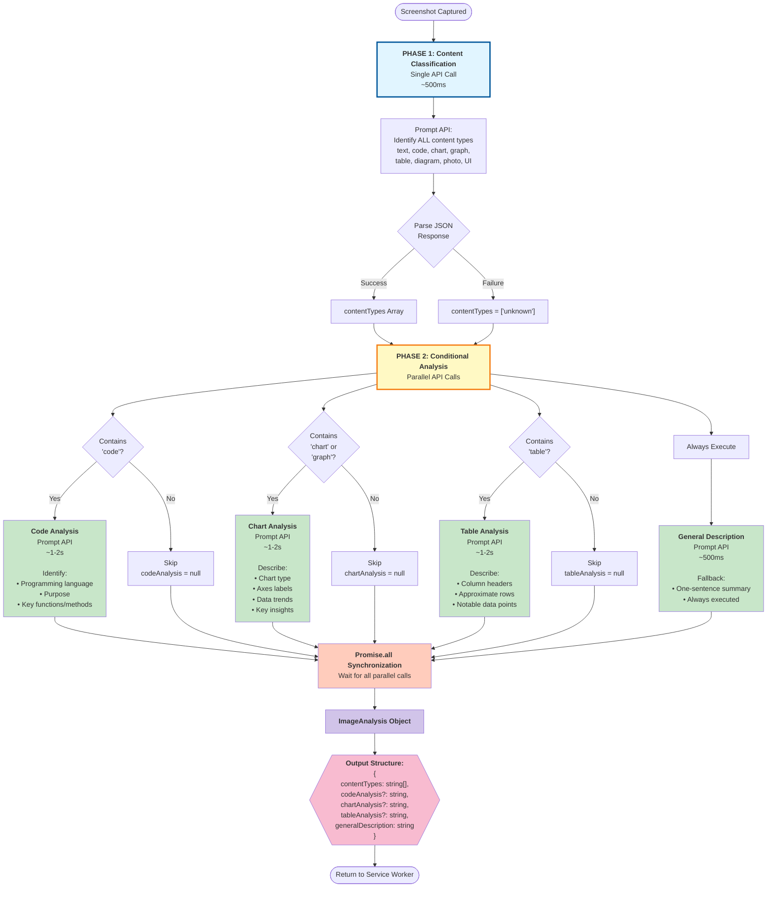
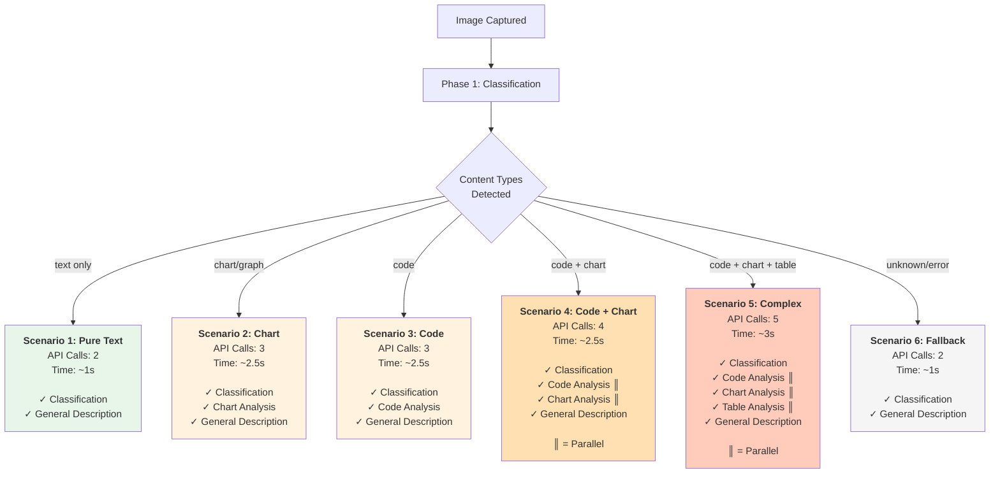

# Multi-Perspective Image Analysis Detail Diagram

## Overview

This diagram illustrates the **key hackathon differentiator**: a sophisticated two-phase multimodal AI approach that intelligently analyzes images based on their content type, avoiding unnecessary API calls while providing deep, specialized insights.

## Architecture Diagram



## Performance Scenarios

```mermaid
gantt
    title Performance Metrics by Content Type
    dateFormat X
    axisFormat %Ls
    
    section Pure Text
    Classification    :0, 500ms
    General Desc      :500ms, 500ms
    Total: ~1s        :milestone, 1000ms, 0ms
    
    section Chart Only
    Classification    :0, 500ms
    Chart Analysis    :500ms, 1500ms
    General Desc      :500ms, 1500ms
    Total: ~2.5s      :milestone, 2500ms, 0ms
    
    section Code + Chart
    Classification    :0, 500ms
    Code Analysis     :500ms, 1500ms
    Chart Analysis    :500ms, 1500ms
    General Desc      :500ms, 1500ms
    Total: ~2.5s      :milestone, 2500ms, 0ms
    
    section Complex (All)
    Classification    :0, 500ms
    Code Analysis     :500ms, 2000ms
    Chart Analysis    :500ms, 2000ms
    Table Analysis    :500ms, 2000ms
    General Desc      :500ms, 2000ms
    Total: ~3s        :milestone, 3000ms, 0ms
```

## Decision Tree



## Key Hackathon Differentiators

### 1. Intelligent Resource Management
- **Conditional Execution**: Only runs specialized analyses when relevant content is detected
- **Parallel Processing**: All Phase 2 analyses run simultaneously via `Promise.all`
- **Performance Budget**: Stays within 3-second total processing time even for complex images

### 2. Multi-Perspective Understanding
- **Code Perspective**: Understands programming languages, identifies functions, explains purpose
- **Data Perspective**: Interprets charts, extracts trends, identifies insights
- **Structural Perspective**: Analyzes tables, understands data organization
- **General Perspective**: Always provides fallback description

### 3. Sophisticated Content Classification
- **Single Classification Call**: Identifies ALL content types in one API request
- **JSON-Structured Response**: Enables programmatic decision-making
- **Graceful Degradation**: Falls back to general description if classification fails

### 4. Real-World Use Cases

**Use Case 1: Developer Documentation**
- Screenshot of API documentation with code examples
- Detects: `["text", "code"]`
- Provides: Language identification + code explanation + general context
- Time: ~2.5s

**Use Case 2: Data Analysis**
- Screenshot of dashboard with multiple charts
- Detects: `["chart", "graph", "table"]`
- Provides: Chart interpretation + table summary + general overview
- Time: ~3s

**Use Case 3: Research Paper**
- Screenshot of academic paper with equations and diagrams
- Detects: `["text", "diagram"]`
- Provides: General description (no specialized analysis needed)
- Time: ~1s

### 5. Integration with Other AI Features

The multi-perspective image analysis enriches other extension features:

- **Email Drafts**: Uses `codeAnalysis` and `chartAnalysis` to write more accurate, context-aware emails
- **Semantic Search**: Indexes all analysis fields for comprehensive search coverage
- **Source Grouping**: Links related captures with similar content types
- **Magic Buttons**: Refine and Clean Up operations leverage image context

## Implementation Reference

See `design.md` Section 3 (AI Handler) for the complete implementation:

```javascript
async analyzeImageContent(imageBlob: Blob): Promise<ImageAnalysis> {
  // Phase 1: Classification (single call)
  const contentTypes = await classifyContent(imageBlob);
  
  // Phase 2: Conditional parallel analysis
  const [code, chart, table, general] = await Promise.all([
    contentTypes.includes('code') ? analyzeCode(imageBlob) : null,
    contentTypes.some(t => t.includes('chart') || t.includes('graph')) 
      ? analyzeChart(imageBlob) : null,
    contentTypes.includes('table') ? analyzeTable(imageBlob) : null,
    getGeneralDescription(imageBlob), // Always executed
  ]);
  
  return { contentTypes, codeAnalysis: code, chartAnalysis: chart, 
           tableAnalysis: table, generalDescription: general };
}
```

## Requirements Coverage

This diagram addresses the following requirements from `requirements.md`:

- **11.1**: Content type classification within 1 second
- **11.2**: Conditional specialized analysis based on detected types
- **11.3**: Code analysis for programming content (language, purpose, functions)
- **11.4**: Chart analysis for data visualizations (type, trends, insights)
- **11.5**: Table analysis for tabular data (headers, rows, data points)
- **11.6**: General description as fallback
- **11.7**: Parallel execution within 5-second budget (achieves 3s)
- **11.8**: Unified scrap context combining audio, text, and image
- **11.9**: Enhanced email drafts using multi-perspective analysis
- **11.10**: Demo video showcasing 3+ multimodal combinations

---

**Status**: ✅ Complete - Ready for hackathon demonstration
