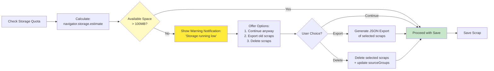
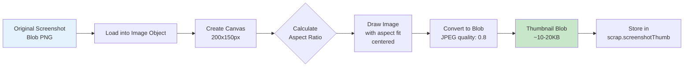
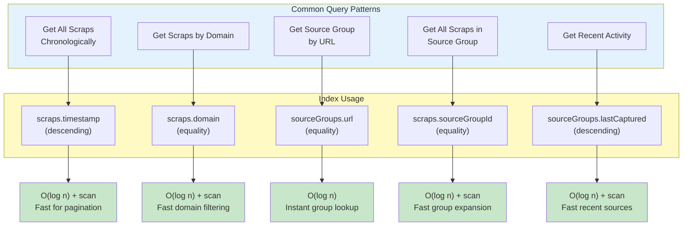
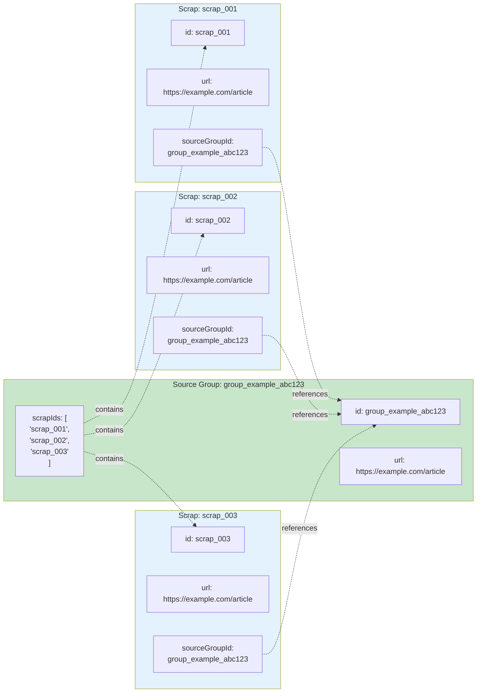
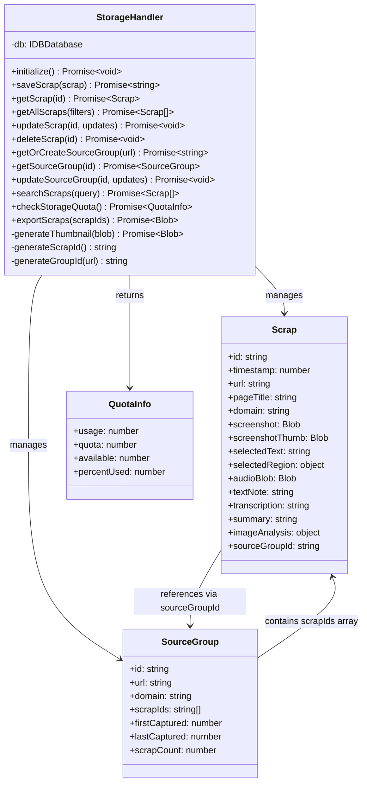

# Storage Architecture Diagram

This diagram illustrates the IndexedDB storage structure, indexing strategy, source grouping logic, and storage management for the Recall Chrome extension.

## IndexedDB Structure and Source Grouping Flow

```mermaid
flowchart TB
    subgraph IDB["IndexedDB: RecallDB"]
        subgraph SCRAPS_STORE["Object Store: scraps"]
            SCRAPS_DATA["Primary Key: id<br/>---<br/>Fields:<br/>• id - string<br/>• timestamp - number<br/>• url - string<br/>• pageTitle - string<br/>• domain - string<br/>• screenshot - Blob<br/>• screenshotThumb - Blob<br/>• selectedText - string<br/>• selectedRegion - object<br/>• audioBlob - Blob<br/>• audioDuration - number<br/>• textNote - string<br/>• transcription - string<br/>• summary - string<br/>• imageAnalysis - object<br/>• processed - boolean<br/>• processingErrors - object<br/>• cleanedText - string<br/>• refinedText - string<br/>• emailDraft - string<br/>• sourceGroupId - string FK<br/>• userTags - array<br/>• userNotes - string"]
            
            SCRAPS_IDX["Indexes:<br/>• timestamp<br/>• url<br/>• domain<br/>• sourceGroupId"]
        end
        
        subgraph GROUPS_STORE["Object Store: sourceGroups"]
            GROUPS_DATA["Primary Key: id<br/>---<br/>Fields:<br/>• id - string<br/>• url - string<br/>• domain - string<br/>• scrapIds - array<br/>• firstCaptured - number<br/>• lastCaptured - number<br/>• scrapCount - number"]
            
            GROUPS_IDX["Indexes:<br/>• url<br/>• lastCaptured"]
        end
    end
    
    START([New Scrap to Save]) --> GEN_THUMB[Generate Thumbnail<br/>200x150px from screenshot]
    
    GEN_THUMB --> CHECK_QUOTA{Storage Quota<br/>Available > 100MB?}
    
    CHECK_QUOTA -->|No| WARN_USER[Display Warning<br/>Notification]
    CHECK_QUOTA -->|Yes| LOOKUP_GROUP
    
    WARN_USER --> LOOKUP_GROUP
    
    LOOKUP_GROUP[Query sourceGroups<br/>by URL index]
    
    LOOKUP_GROUP --> GROUP_EXISTS{Source Group<br/>Exists?}
    
    GROUP_EXISTS -->|Yes| GET_GROUP[Retrieve Existing<br/>Source Group]
    GROUP_EXISTS -->|No| CREATE_GROUP["Create New Source Group<br/>id = group_domain_urlhash<br/>url = scrap.url<br/>domain = scrap.domain<br/>scrapIds = []<br/>firstCaptured = now<br/>lastCaptured = now<br/>scrapCount = 0"]
    
    GET_GROUP --> UPDATE_GROUP[Update Source Group:<br/>• Add scrapId to scrapIds array<br/>• Update lastCaptured = now<br/>• Increment scrapCount]
    
    CREATE_GROUP --> SAVE_GROUP[Save Source Group<br/>to sourceGroups store]
    UPDATE_GROUP --> SAVE_GROUP
    
    SAVE_GROUP --> LINK_SCRAP[Set scrap.sourceGroupId<br/>to group.id]
    
    LINK_SCRAP --> SAVE_SCRAP[Save Scrap to scraps store<br/>with all data + thumbnail]
    
    SAVE_SCRAP --> VERIFY{Save<br/>Successful?}
    
    VERIFY -->|Yes| BIDIR[Bidirectional Link Established:<br/>scrap.sourceGroupId → group.id<br/>group.scrapIds contains scrap.id]
    VERIFY -->|No| ERROR[Throw Storage Error<br/>Offer JSON Export]
    
    BIDIR --> SUCCESS([Storage Complete])
    ERROR --> FAIL([Storage Failed])
    
    style SCRAPS_STORE fill:#e3f2fd
    style GROUPS_STORE fill:#c8e6c9
    style CHECK_QUOTA fill:#fff9c4
    style GROUP_EXISTS fill:#fff9c4
    style VERIFY fill:#fff9c4
    style SUCCESS fill:#c8e6c9
    style FAIL fill:#ffcdd2
```

## Storage Quota Management Flow

## Thumbnail Generation Process

## Index Strategy and Query Patterns

## Bidirectional Linking Example

## Storage Operations API

## Key Design Decisions

### 1. Two-Store Architecture
- **scraps store**: Contains all capture data with full fidelity
- **sourceGroups store**: Lightweight aggregation layer for URL-based grouping
- Separation allows efficient queries without loading full scrap data

### 2. Bidirectional Linking
- Scraps reference their group via `sourceGroupId` (foreign key)
- Groups maintain array of `scrapIds` for reverse lookup
- Enables both "find group for scrap" and "find all scraps in group" queries

### 3. Thumbnail Strategy
- Generate 200x150px thumbnails immediately on save
- Store as separate field to avoid loading full screenshots in list views
- JPEG compression (quality 0.8) reduces size by ~90%
- Typical thumbnail: 10-20KB vs 200-500KB for full screenshot

### 4. Index Selection
- **timestamp**: Primary sorting for chronological views
- **url**: Fast lookup for source grouping logic
- **domain**: Enables domain-based filtering
- **sourceGroupId**: Efficient group expansion queries
- **lastCaptured**: Recent activity sorting for groups

### 5. Storage Quota Management
- Check quota before every save operation
- Warn at 100MB threshold (conservative for typical usage)
- Offer export/delete options to free space
- Never block saves unless quota truly exceeded

### 6. Source Group ID Generation
- Format: `group_{domain}_{urlhash}`
- Deterministic: same URL always generates same ID
- Enables idempotent group creation
- Example: `group_example.com_a3f2b9c1`

## Performance Characteristics

| Operation | Complexity | Notes |
|-----------|-----------|-------|
| Save scrap | O(log n) | Index updates |
| Get scrap by ID | O(1) | Primary key lookup |
| Get all scraps | O(n) | Full scan with index ordering |
| Get scraps by domain | O(k log n) | Index scan where k = matches |
| Get source group | O(log n) | URL index lookup |
| Expand source group | O(m log n) | m = scraps in group |
| Check storage quota | O(1) | Browser API call |
| Generate thumbnail | O(1) | Fixed size operation |

## Requirements Coverage

This diagram addresses the following requirements:

- **3.1**: IndexedDB storage in browser profile
- **3.2**: Unique ID generation (timestamp + random)
- **3.3**: Automatic URL-based source grouping with bidirectional links
- **3.4**: Thumbnail generation (200x150px)
- **3.5**: Blob storage for audio/screenshots, strings for text
- **3.6**: Storage quota warning at 100MB threshold
- **3.7**: Separate sourceGroups index for efficient retrieval
