# Error Handling Flow Diagram

This diagram illustrates the comprehensive error handling and recovery strategies implemented throughout the Recall Chrome extension architecture.

## Overview

The extension implements a multi-layered error handling approach with graceful degradation, ensuring users never lose captured content even when components fail.

## Error Handling Flow

```mermaid
flowchart TD
    START([User Action / System Event]) --> DETECT{Error<br/>Detected?}
    
    DETECT -->|No Error| SUCCESS([Normal Flow])
    DETECT -->|Error| CLASSIFY{Error<br/>Type?}
    
    %% Error Type Classification
    CLASSIFY -->|Microphone Permission| MIC_ERROR
    CLASSIFY -->|AI API Unavailable| AI_UNAVAIL
    CLASSIFY -->|AI Processing Fails| AI_FAIL
    CLASSIFY -->|Storage Quota Exceeded| QUOTA_ERROR
    CLASSIFY -->|IndexedDB Connection Fails| IDB_ERROR
    CLASSIFY -->|Message Timeout| TIMEOUT_ERROR
    
    %% 1. Microphone Permission Denied
    MIC_ERROR[Microphone Permission Denied]
    MIC_ERROR --> MIC_NOTIFY[Show Notification:<br/>'Microphone access denied.<br/>You can still capture with text notes.']
    MIC_NOTIFY --> MIC_SAVE[Save Screenshot + Text Content]
    MIC_SAVE --> MIC_OFFER[Offer Text Note Option]
    MIC_OFFER --> MIC_RETRY{User Wants<br/>to Retry?}
    MIC_RETRY -->|Yes| MIC_REQUEST[Request Permission Again]
    MIC_REQUEST --> MIC_GRANTED{Permission<br/>Granted?}
    MIC_GRANTED -->|Yes| CONTINUE[Continue with Audio]
    MIC_GRANTED -->|No| MIC_OFFER
    MIC_RETRY -->|No| TEXT_INPUT[Use Text Note Instead]
    TEXT_INPUT --> SAVE_PARTIAL
    
    %% 2. AI API Unavailable
    AI_UNAVAIL[AI API Unavailable]
    AI_UNAVAIL --> CHECK_AI{Check AI<br/>Availability}
    CHECK_AI -->|Not in Window| AI_NOT_AVAIL[Show Error:<br/>'Chrome AI not available.<br/>Update Chrome to latest version.']
    CHECK_AI -->|Needs Download| AI_DOWNLOAD[Show Notification:<br/>'Downloading AI model...<br/>This may take a few minutes.']
    AI_DOWNLOAD --> TRIGGER_DL[Trigger Model Download]
    TRIGGER_DL --> WAIT_DL{Download<br/>Complete?}
    WAIT_DL -->|Yes| CONTINUE
    WAIT_DL -->|Timeout| AI_SAVE_RAW
    CHECK_AI -->|Unavailable| AI_SAVE_RAW[Save Raw Data<br/>Without AI Processing]
    AI_NOT_AVAIL --> AI_SAVE_RAW
    AI_SAVE_RAW --> AI_RETRY_OPTION[Show Retry Option:<br/>'Process with AI later?']
    AI_RETRY_OPTION --> SAVE_PARTIAL
    
    %% 3. AI Processing Fails
    AI_FAIL[AI Processing Fails]
    AI_FAIL --> PARALLEL{Which AI<br/>Task Failed?}
    
    PARALLEL -->|Transcription| TRANS_FAIL[Transcription Failed]
    PARALLEL -->|Summarization| SUM_FAIL[Summarization Failed]
    PARALLEL -->|Image Analysis| IMG_FAIL[Image Analysis Failed]
    
    TRANS_FAIL --> TRANS_RETRY{Retry<br/>Count < 3?}
    TRANS_RETRY -->|Yes| TRANS_BACKOFF[Wait: 1s → 2s → 4s<br/>Exponential Backoff]
    TRANS_BACKOFF --> TRANS_ATTEMPT[Retry Transcription]
    TRANS_ATTEMPT --> TRANS_SUCCESS{Success?}
    TRANS_SUCCESS -->|Yes| CONTINUE
    TRANS_SUCCESS -->|No| TRANS_RETRY
    TRANS_RETRY -->|No| TRANS_NULL[Set transcription = null<br/>Mark error in processingErrors]
    TRANS_NULL --> SAVE_PARTIAL
    
    SUM_FAIL --> SUM_RETRY{Retry<br/>Count < 3?}
    SUM_RETRY -->|Yes| SUM_BACKOFF[Wait: 1s → 2s → 4s<br/>Exponential Backoff]
    SUM_BACKOFF --> SUM_ATTEMPT[Retry Summarization]
    SUM_ATTEMPT --> SUM_SUCCESS{Success?}
    SUM_SUCCESS -->|Yes| CONTINUE
    SUM_SUCCESS -->|No| SUM_RETRY
    SUM_RETRY -->|No| SUM_NULL[Set summary = null<br/>Mark error in processingErrors]
    SUM_NULL --> SAVE_PARTIAL
    
    IMG_FAIL --> IMG_RETRY{Retry<br/>Count < 3?}
    IMG_RETRY -->|Yes| IMG_BACKOFF[Wait: 1s → 2s → 4s<br/>Exponential Backoff]
    IMG_BACKOFF --> IMG_ATTEMPT[Retry Image Analysis]
    IMG_ATTEMPT --> IMG_SUCCESS{Success?}
    IMG_SUCCESS -->|Yes| CONTINUE
    IMG_SUCCESS -->|No| IMG_RETRY
    IMG_RETRY -->|No| IMG_FALLBACK["Set imageAnalysis =<br/>{contentTypes: ['unknown'],<br/>generalDescription: 'Analysis failed'}"]
    IMG_FALLBACK --> SAVE_PARTIAL
    
    %% 4. Storage Quota Exceeded
    QUOTA_ERROR[Storage Quota Exceeded]
    QUOTA_ERROR --> CHECK_QUOTA{Quota<br/>Usage?}
    CHECK_QUOTA -->|> 90%| QUOTA_WARN[Show Warning:<br/>'Storage nearly full.<br/>Please delete old scraps.']
    CHECK_QUOTA -->|100%| QUOTA_FULL[Show Error:<br/>'Storage full.<br/>Cannot save scrap.']
    QUOTA_WARN --> ATTEMPT_SAVE[Attempt to Save]
    ATTEMPT_SAVE --> SAVE_SUCCESS{Save<br/>Successful?}
    SAVE_SUCCESS -->|Yes| SUCCESS
    SAVE_SUCCESS -->|No| QUOTA_FULL
    QUOTA_FULL --> OFFER_EXPORT[Offer Export Option:<br/>'Export as JSON?']
    OFFER_EXPORT --> USER_EXPORT{User<br/>Accepts?}
    USER_EXPORT -->|Yes| EXPORT_JSON[Export Scrap as JSON File]
    EXPORT_JSON --> DOWNLOAD[Trigger Browser Download]
    DOWNLOAD --> NOTIFY_EXPORT[Notify: 'Scrap exported.<br/>Free up space to save locally.']
    USER_EXPORT -->|No| NOTIFY_LOST[Notify: 'Scrap not saved.<br/>Free up storage space.']
    
    %% 5. IndexedDB Connection Fails
    IDB_ERROR[IndexedDB Connection Fails]
    IDB_ERROR --> IDB_RETRY_COUNT{Retry<br/>Count < 3?}
    IDB_RETRY_COUNT -->|Yes| IDB_BACKOFF[Wait: 1s → 2s → 4s<br/>Exponential Backoff]
    IDB_BACKOFF --> IDB_ATTEMPT[Attempt Connection]
    IDB_ATTEMPT --> IDB_CONN_SUCCESS{Connection<br/>Successful?}
    IDB_CONN_SUCCESS -->|Yes| CONTINUE
    IDB_CONN_SUCCESS -->|No| IDB_RETRY_COUNT
    IDB_RETRY_COUNT -->|No| IDB_FALLBACK[Fallback to<br/>chrome.storage.local]
    IDB_FALLBACK --> FALLBACK_WARN[Show Warning:<br/>'Using limited storage.<br/>Capacity: ~5MB']
    FALLBACK_WARN --> FALLBACK_SAVE[Save to chrome.storage.local]
    FALLBACK_SAVE --> FALLBACK_SUCCESS{Save<br/>Successful?}
    FALLBACK_SUCCESS -->|Yes| NOTIFY_FALLBACK[Notify: 'Saved with limited storage.<br/>Restart browser to restore full capacity.']
    FALLBACK_SUCCESS -->|No| CRITICAL_ERROR[Critical Error:<br/>Cannot Save Data]
    CRITICAL_ERROR --> OFFER_EXPORT
    
    %% 6. Message Timeout
    TIMEOUT_ERROR[Message Timeout]
    TIMEOUT_ERROR --> TIMEOUT_TYPE{Message<br/>Type?}
    TIMEOUT_TYPE -->|CAPTURE_COMPLETE| TIMEOUT_10S[Timeout: 10 seconds]
    TIMEOUT_TYPE -->|AI Processing| TIMEOUT_10S
    TIMEOUT_TYPE -->|GET_ALL_SCRAPS| TIMEOUT_5S[Timeout: 5 seconds]
    TIMEOUT_TYPE -->|Other Queries| TIMEOUT_5S
    
    TIMEOUT_10S --> TIMEOUT_NOTIFY[Show Error:<br/>'Operation timed out.<br/>Please try again.']
    TIMEOUT_5S --> TIMEOUT_NOTIFY
    TIMEOUT_NOTIFY --> TIMEOUT_RETRY_OPTION[Offer Retry Button]
    TIMEOUT_RETRY_OPTION --> USER_RETRY{User<br/>Retries?}
    USER_RETRY -->|Yes| RETRY_MSG[Resend Message]
    RETRY_MSG --> RETRY_SUCCESS{Success?}
    RETRY_SUCCESS -->|Yes| SUCCESS
    RETRY_SUCCESS -->|No| TIMEOUT_NOTIFY
    USER_RETRY -->|No| CANCEL[User Cancels Operation]
    
    %% Partial Save Path
    SAVE_PARTIAL[Save Scrap with Partial Data]
    SAVE_PARTIAL --> MARK_ERRORS[Mark processingErrors Object<br/>with Failed Components]
    MARK_ERRORS --> SET_PROCESSED[Set processed = true]
    SET_PROCESSED --> SAVE_TO_DB[Save to IndexedDB]
    SAVE_TO_DB --> NOTIFY_PARTIAL[Show Notification:<br/>'Scrap saved with partial processing.<br/>Some AI features failed.']
    NOTIFY_PARTIAL --> PARTIAL_SUCCESS([Partial Success])
    
    %% Graceful Degradation Strategy
    CONTINUE --> DEGRADE{Graceful<br/>Degradation<br/>Needed?}
    DEGRADE -->|Yes| DEGRADE_STRATEGY[Apply Degradation Strategy]
    DEGRADE -->|No| SUCCESS
    
    DEGRADE_STRATEGY --> DEGRADE_TYPE{What to<br/>Degrade?}
    DEGRADE_TYPE -->|No Audio| USE_TEXT[Use Text Note Only]
    DEGRADE_TYPE -->|No AI| USE_RAW[Use Raw Content Only]
    DEGRADE_TYPE -->|No Image Analysis| USE_SCREENSHOT[Use Screenshot Only]
    
    USE_TEXT --> SUCCESS
    USE_RAW --> SUCCESS
    USE_SCREENSHOT --> SUCCESS
    
    %% Styling
    style START fill:#e3f2fd
    style SUCCESS fill:#c8e6c9
    style PARTIAL_SUCCESS fill:#fff9c4
    style CRITICAL_ERROR fill:#ffcdd2
    style CANCEL fill:#f5f5f5
    
    style MIC_ERROR fill:#ffe0b2
    style AI_UNAVAIL fill:#ffe0b2
    style AI_FAIL fill:#ffe0b2
    style QUOTA_ERROR fill:#ffe0b2
    style IDB_ERROR fill:#ffe0b2
    style TIMEOUT_ERROR fill:#ffe0b2
    
    style SAVE_PARTIAL fill:#fff9c4
    style DEGRADE_STRATEGY fill:#e1bee7
```



## Error Recovery Strategies

### 1. Microphone Permission Denied
- **Detection**: `NotAllowedError` from `getUserMedia()`
- **Recovery**: 
  - Save screenshot + extracted text immediately
  - Offer text note input as alternative
  - Allow retry with permission request
- **User Impact**: Minimal - can still capture with text
- **Requirement**: 9.1

### 2. AI API Unavailable
- **Detection**: `'ai' not in window` or `capabilities.available === 'no'`
- **Recovery**:
  - Check if model needs download
  - Trigger download if available
  - Save raw data without AI processing
  - Offer retry option for later processing
- **User Impact**: Moderate - loses AI features but data preserved
- **Requirement**: 9.2

### 3. AI Processing Fails
- **Detection**: Promise rejection from AI Handler methods
- **Recovery**:
  - Retry with exponential backoff (1s, 2s, 4s)
  - Maximum 3 attempts per operation
  - Continue with partial results (Promise.allSettled)
  - Mark failed components in `processingErrors` object
- **User Impact**: Low - partial AI features available
- **Requirement**: 9.2, 9.4

### 4. Storage Quota Exceeded
- **Detection**: `QuotaExceededError` or quota check > 90%
- **Recovery**:
  - Show warning at 90% usage
  - Offer JSON export when full
  - Suggest deleting old scraps
- **User Impact**: High - cannot save locally, but can export
- **Requirement**: 9.3

### 5. IndexedDB Connection Fails
- **Detection**: Connection error during `indexedDB.open()`
- **Recovery**:
  - Retry with exponential backoff (1s, 2s, 4s)
  - Maximum 3 attempts
  - Fallback to `chrome.storage.local` (limited to ~5MB)
  - Notify user of limited capacity
- **User Impact**: Moderate - reduced storage capacity
- **Requirement**: 9.3

### 6. Message Timeout
- **Detection**: Promise.race timeout (5s or 10s depending on operation)
- **Recovery**:
  - Show clear error message
  - Offer retry button
  - Log timeout for debugging
- **User Impact**: Moderate - requires manual retry
- **Requirement**: 9.4

## Exponential Backoff Implementation

```javascript
async function retryWithBackoff(fn, maxRetries = 3) {
  for (let attempt = 0; attempt < maxRetries; attempt++) {
    try {
      return await fn();
    } catch (error) {
      if (attempt === maxRetries - 1) throw error;
      
      const delay = 1000 * Math.pow(2, attempt); // 1s, 2s, 4s
      console.log(`Retry attempt ${attempt + 1} after ${delay}ms`);
      await new Promise(resolve => setTimeout(resolve, delay));
    }
  }
}
```

## Graceful Degradation Hierarchy

1. **Full Feature**: Audio + Text + Image Analysis
2. **Degrade Audio**: Text + Image Analysis (mic permission denied)
3. **Degrade AI**: Raw content only (AI unavailable)
4. **Degrade Storage**: Export to JSON (quota exceeded)
5. **Critical Failure**: User notification + manual intervention required

## Error Logging Strategy

All errors are logged to console with:
- Error type and message
- Component where error occurred
- Timestamp
- User action context
- Recovery action taken

**Note**: Logging is removed in production builds to protect user privacy.

## Requirements Coverage

- **9.1**: Microphone permission denied → Save screenshot + text, allow retry ✓
- **9.2**: AI API unavailable → Save raw data, show retry option ✓
- **9.3**: Storage quota exceeded → Offer JSON export ✓
- **9.4**: IndexedDB connection fails → Fallback to chrome.storage.local ✓
- **9.5**: Message timeout → Show error, allow retry ✓
- Exponential backoff retry logic (1s, 2s, 4s) ✓
- Graceful degradation strategy ✓
