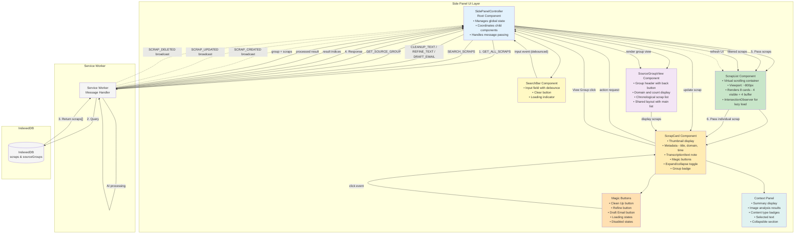
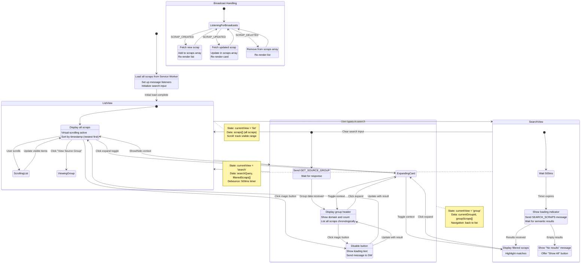
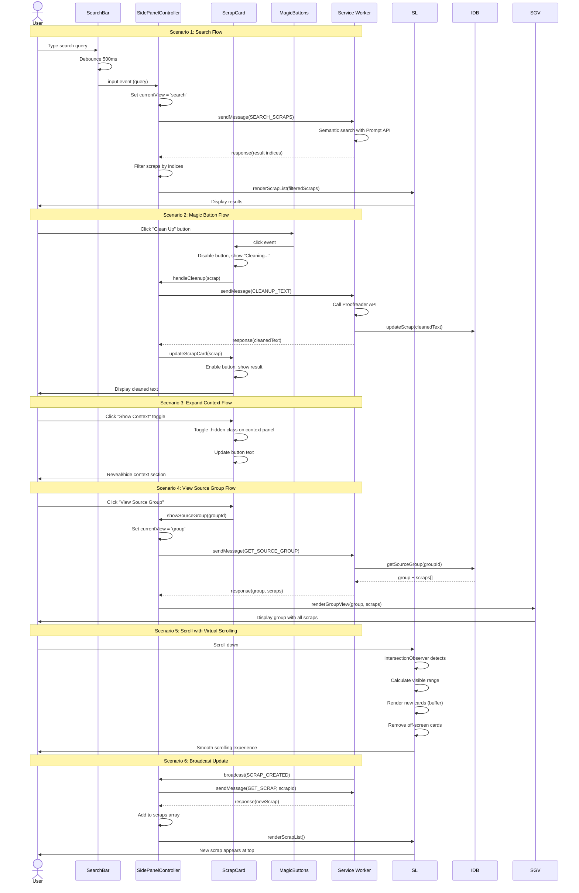
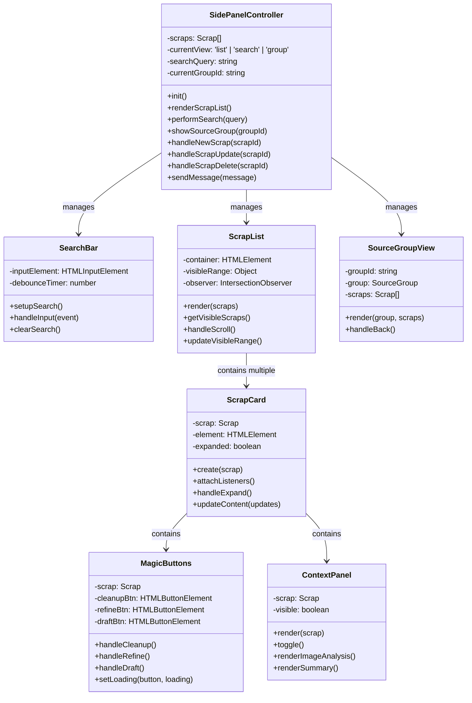
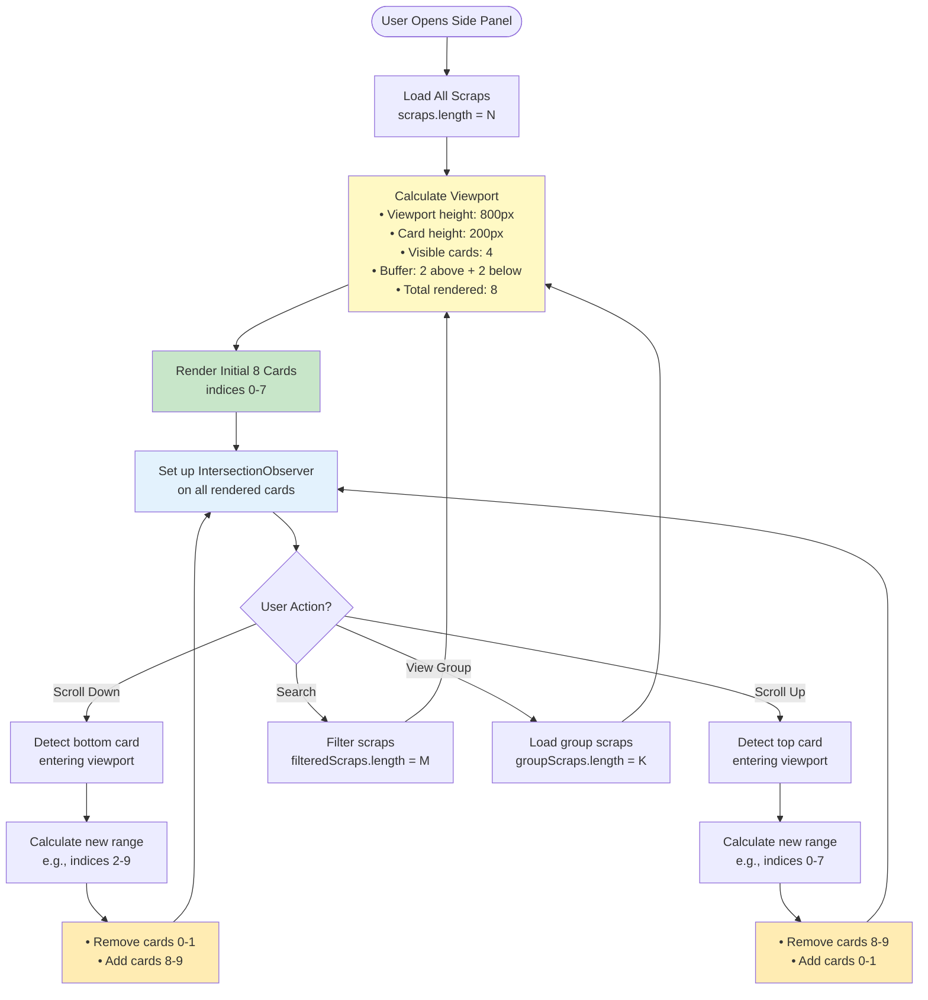

# Side Panel UI Component Diagram

This diagram shows the component hierarchy, data flow, event handling, and state management for the Side Panel UI.

## Component Hierarchy and Data Flow

## State Management Flow

## Event Handling Flow

## Component State Details

## Virtual Scrolling Implementation

## Performance Optimizations

### 1. Virtual Scrolling
- Only render 8 cards at a time (4 visible + 4 buffer)
- Use IntersectionObserver for efficient scroll detection
- Dynamically add/remove DOM elements as user scrolls
- Reduces memory footprint for large scrap collections (>50 items)

### 2. Lazy Loading
- Thumbnails loaded only when cards enter viewport
- Use `loading="lazy"` attribute on img tags
- Defer loading of context panels until expanded

### 3. Debouncing
- Search input debounced to 500ms
- Prevents excessive API calls during typing
- Cancels pending searches when new input arrives

### 4. Event Delegation
- Attach listeners to parent container, not individual cards
- Use event.target to identify clicked element
- Reduces memory usage and improves performance

### 5. State Caching
- Cache scraps array in SidePanelController
- Only re-fetch when broadcast update received
- Avoid redundant IndexedDB queries

---

## Requirements Coverage

This diagram addresses the following requirements:

- **Requirement 4.1**: Side panel opens within 200ms with smooth animation
- **Requirement 4.2**: Scrap cards display thumbnail, metadata, transcription, and group badge
- **Requirement 4.3**: Scraps retrieved and rendered within 500ms
- **Requirement 4.4**: "View Source Group" button expands to show linked scraps
- **Requirement 4.5**: Virtual scrolling for lists >50 scraps
- **Requirement 4.6**: Scrap cards expand with smooth animation within 300ms

## Key Interactions

1. **Search**: User types → debounce → semantic search → filter results → render
2. **Magic Buttons**: Click → disable → send message → AI processing → update → enable
3. **Expand Context**: Click toggle → toggle class → update button text
4. **View Group**: Click → load group → render group view → display scraps
5. **Scroll**: Scroll event → IntersectionObserver → calculate range → update DOM
6. **Broadcast**: Service Worker sends update → fetch new data → update state → re-render
