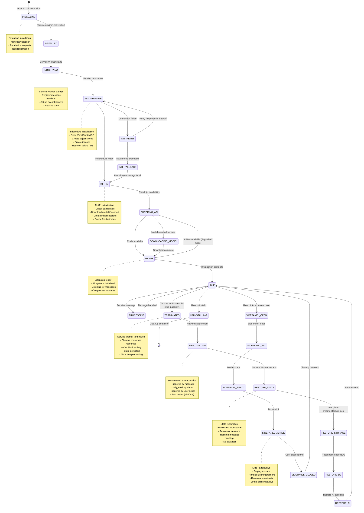
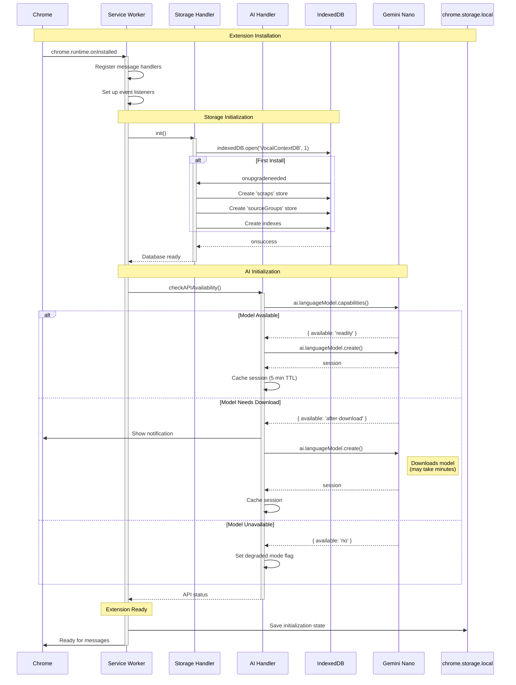
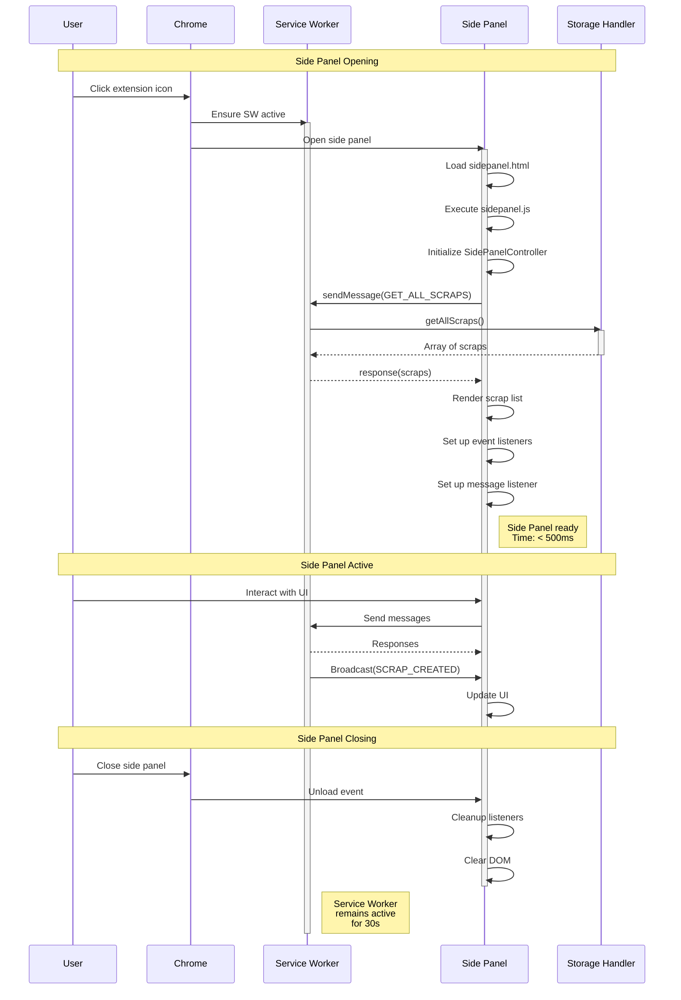
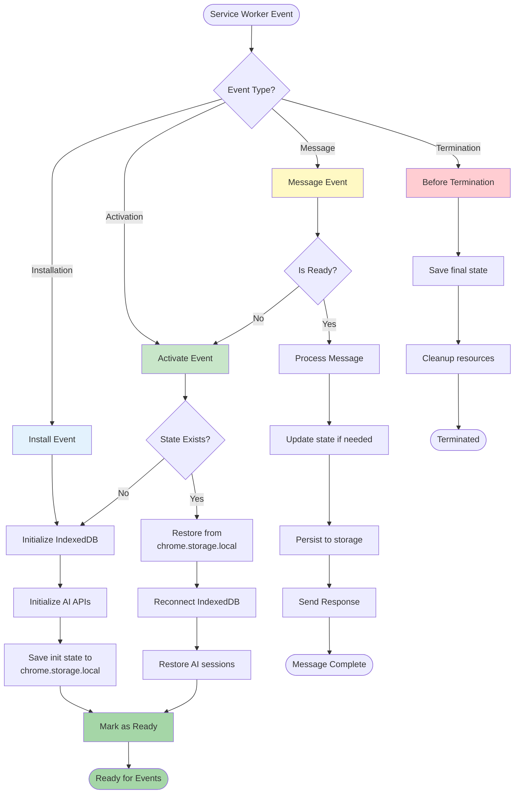

# Extension Lifecycle Diagram

This diagram illustrates the complete lifecycle of the Recall Chrome Extension, including installation, initialization, service worker lifecycle management, state restoration, and side panel interactions.

## Overview

The extension follows Chrome's Manifest V3 lifecycle model where the service worker can be terminated and reactivated by Chrome to conserve resources. The architecture ensures state persistence and seamless restoration across service worker terminations.

## Lifecycle State Machine



## Detailed Initialization Sequence



## Service Worker Termination and Reactivation

```mermaid
sequenceDiagram
    participant Chrome
    participant SW as Service Worker
    participant STH as Storage Handler
    participant AIH as AI Handler
    participant STORE as chrome.storage.local
    participant IDB as IndexedDB
    
    Note over Chrome,IDB: Service Worker Active
    
    SW->>SW: Process messages
    SW->>SW: Handle events
    
    Note over Chrome: 30 seconds of inactivity
    
    Chrome->>SW: Terminate service worker
    deactivate SW
    Note right of SW: Service Worker<br/>terminated<br/>(conserve resources)
    
    Note over Chrome,IDB: Service Worker Terminated
    
    Chrome->>Chrome: New message arrives
    
    Note over Chrome,IDB: Service Worker Reactivation
    
    Chrome->>SW: Restart service worker
    activate SW
    SW->>SW: Re-register handlers
    
    Note over SW,IDB: State Restoration
    
    SW->>STORE: Load persisted state
    STORE-->>SW: { lastInitTime, degradedMode }
    
    SW->>STH: reconnect()
    activate STH
    STH->>IDB: Reopen connection
    IDB-->>STH: Connection ready
    STH-->>SW: Storage reconnected
    deactivate STH
    
    SW->>AIH: restoreSessions()
    activate AIH
    
    alt Sessions Still Cached
        AIH->>AIH: Check session timestamps
        AIH->>AIH: Sessions valid (< 5 min)
        AIH-->>SW: Sessions restored
    else Sessions Expired
        AIH->>AIH: Clear stale sessions
        AIH-->>SW: Sessions cleared (will recreate on demand)
    end
    
    deactivate AIH
    
    SW->>Chrome: Ready to process message
    Note right of SW: Total restoration<br/>time: < 500ms
    
    SW->>SW: Handle queued message
    deactivate SW
```

## Side Panel Lifecycle



## State Persistence Strategy



## Key Lifecycle Events

### 1. Installation (chrome.runtime.onInstalled)

**Triggers:**
- User installs extension from Chrome Web Store
- Developer loads unpacked extension
- Extension updates to new version

**Actions:**
- Create IndexedDB database and object stores
- Initialize default settings in chrome.storage.local
- Check AI API availability
- Register content scripts
- Set up alarm for periodic cleanup (optional)

**Timing:** ~1-2 seconds (first install), ~5-10 seconds if model download needed

### 2. Service Worker Activation

**Triggers:**
- Extension installation
- Browser startup
- Service worker restart after termination

**Actions:**
- Re-register message handlers
- Reconnect to IndexedDB
- Restore AI session cache (if within 5-minute TTL)
- Load persisted state from chrome.storage.local
- Resume message processing

**Timing:** <500ms (from Requirements 12.3)

### 3. Service Worker Termination

**Triggers:**
- 30 seconds of inactivity (Chrome's default)
- Browser resource constraints
- Extension update

**Actions:**
- Save current state to chrome.storage.local
- Close IndexedDB connections gracefully
- Clear AI session cache
- Remove event listeners

**State Preserved:**
- Initialization status
- Degraded mode flag
- Last activity timestamp
- Pending operation flags

**State NOT Preserved:**
- Active AI sessions (recreated on demand)
- In-memory caches
- Temporary processing data

### 4. Side Panel Open/Close

**Open Actions:**
- Ensure service worker is active
- Load side panel HTML/JS
- Fetch all scraps from IndexedDB
- Render initial UI
- Set up broadcast message listener

**Close Actions:**
- Remove event listeners
- Clear DOM elements
- Stop virtual scrolling observers
- Service worker remains active for 30s

**Timing:** <200ms to open (Requirements 4.1), <100ms to close

### 5. IndexedDB Connection Management

**Initial Connection:**
- Open database with version 1
- Create object stores if first install
- Create indexes for efficient queries
- Retry up to 3 times on failure
- Fallback to chrome.storage.local if all retries fail

**Reconnection After Termination:**
- Reopen existing database
- Verify object stores exist
- Restore transaction handlers
- No data migration needed

**Connection Failure Handling:**
- Exponential backoff: 1s, 2s, 4s
- Fallback to chrome.storage.local (limited capacity)
- User notification if fallback activated

### 6. AI API Session Management

**Session Creation:**
- Check capabilities before creating
- Create session on first use (lazy initialization)
- Cache session with 5-minute TTL
- Store timestamp for expiration check

**Session Restoration:**
- Check timestamp on service worker reactivation
- If < 5 minutes: reuse existing session
- If > 5 minutes: clear and recreate on demand
- No persistent storage of sessions

**Session Cleanup:**
- Automatic cleanup on 5-minute timeout
- Manual cleanup on service worker termination
- Destroy session objects to free memory

## Performance Targets

| Lifecycle Event | Target Time | Requirement |
|----------------|-------------|-------------|
| Initial Installation | 1-2s | 12.1 |
| Service Worker Activation | <500ms | 12.3 |
| IndexedDB Connection | <1s | 12.1 |
| AI Session Creation | 1-5s | 12.2 |
| State Restoration | <500ms | 12.3 |
| Side Panel Open | <200ms | 4.1 |
| Side Panel Close | <100ms | 12.5 |

## Error Recovery

### IndexedDB Failure
1. Retry connection 3 times with exponential backoff
2. If all retries fail, activate fallback mode
3. Use chrome.storage.local (limited to 10MB)
4. Notify user of degraded functionality
5. Offer data export option

### AI API Unavailable
1. Check capabilities on initialization
2. If unavailable, set degraded mode flag
3. Save scraps without AI processing
4. Allow manual retry from UI
5. Continue with core capture functionality

### Service Worker Crash
1. Chrome automatically restarts service worker
2. State restoration from chrome.storage.local
3. Reconnect to IndexedDB
4. Resume message processing
5. No user intervention required

### Side Panel Crash
1. User can reopen side panel
2. Fresh initialization from storage
3. No data loss (stored in IndexedDB)
4. Service worker unaffected

## Validation Checklist

- [x] All lifecycle events from Requirements 12.1-12.5 are documented
- [x] Service worker install, activate, terminate, and reactivate flows are shown
- [x] State restoration after termination is detailed
- [x] IndexedDB connection initialization and reconnection are illustrated
- [x] AI API session initialization and caching strategy are explained
- [x] Side panel open/close lifecycle is documented
- [x] Performance targets match requirements
- [x] Error recovery paths are defined
- [x] Diagram uses standard Mermaid notation
- [x] Timing annotations are accurate
- [x] All components from architecture are included

